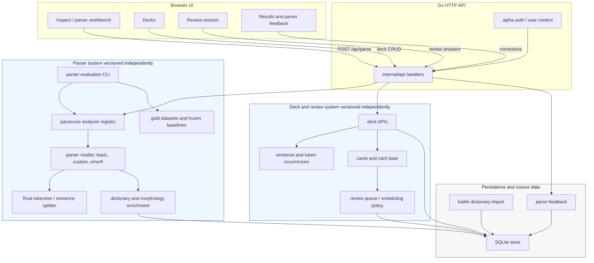

# FinEstDB Architecture

_Current as of 2026-05-01 — see [docs/CHANGELOG.md](docs/CHANGELOG.md) for revisions._

Role-aware Finnish and Estonian reading app focused on dictionary-backed
lemmatization, deck creation, review, parser feedback, and parser evaluation.

Subsystem behavior versions are tracked separately in
[`docs/SYSTEM_VERSIONING.md`](docs/SYSTEM_VERSIONING.md). Parser behavior,
parser baselines, and deck review scheduling should not share a single version
number because they change independently.

## What Exists Today

Current product surface on `main`:

- public landing/about/sign-in routes
- authenticated dashboard, Inspect, Decks, Review, and Results routes
- admin-only parser workbench and feedback routes
- Inspect page for Finnish or Estonian text
- parser selection in the admin workbench: `basic` and `custom`
- file load support for `.txt` / `.md`
- results page with sortable output, POS filter chips, coverage gauge, and parse duration
- structured parse-stage stats returned from `parsecore` and `/api/parse`
- deck, known-word, review, and parse-feedback APIs
- parser evaluation CLI for `basic`, `custom`, and `omorfi`
- dataset-driven evaluation workflow in `internal/eval`
- expanded Finnish and Estonian gold datasets under `testdata/parser-eval/*/gold`
- external-adapter slot for an Omorfi baseline in `internal/parsecore`
- Playwright coverage for parse/results, POS filtering, language switching, file upload, and mobile nav

Important distinction:

- `basic` and `custom` are admin workbench parser modes in the browser UI
- `omorfi` exists today as an evaluation/parser-core integration point, but not as a browser button

## High-Level Architecture



```text
CURRENT

+--------------------------------------------------------------------------------+
| Browser UI                                                                     |
| web/index.html + web/app.ts                                                    |
|                                                                                |
| - Workbench nav shell                                                          |
| - Parse Text page                                                              |
| - Parser buttons: basic, custom                                                |
| - Language warning and file load                                               |
| - Results table, POS filter chips                                              |
| - Coverage gauge and parse duration                                            |
+-----------------------------------+--------------------------------------------+
                                    |
                                    | POST /api/parse
                                    v
+--------------------------------------------------------------------------------+
| Go HTTP Server                                                                 |
| cmd/server + internal/api                                                      |
|                                                                                |
| Active user-facing flow:                                                       |
| - serve static frontend                                                        |
| - validate parse request                                                       |
| - call parsecore.Analyze(...)                                                  |
| - return JSON parse result plus parse stats                                    |
|                                                                                |
| Partial / not current UI focus:                                                |
| - /api/decks                                                                   |
| - mock /api/me                                                                 |
| - mock review endpoints                                                        |
+-----------------------------------+--------------------------------------------+
                                    |
                                    | parsecore.Analyze(db, lang, text, parser)
                                    v
+--------------------------------------------------------------------------------+
| Parse Core                                                                     |
| internal/parsecore                                                             |
|                                                                                |
| Shared parser orchestration layer:                                             |
| - request validation                                                           |
| - parser registry                                                              |
| - parser definitions                                                           |
| - sentence/token conversion                                                    |
| - dictionary resolution                                                        |
| - gloss lookup                                                                 |
| - word aggregation                                                             |
| - parse-stage observability metrics                                            |
|                                                                                |
| Parsers currently wired in:                                                    |
| - basic   -> Rust analyzer + direct dictionary lookup                          |
| - custom  -> Rust analyzer + fallback enrichment rules                         |
| - omorfi  -> external Finnish adapter slot + override rules                    |
+--------------------------+--------------------------+--------------------------+
                           |                          |
                           | FFI                      | forms/lemmas/glosses
                           v                          v
+--------------------------------+      +----------------------------------------+
| Rust Parser Library            |      | SQLite + Dictionary Data               |
| parser/src/lib.rs              |      | internal/store                         |
|                                |      |                                        |
| - NFC normalization            |      | - forms table                          |
| - sentence splitting           |      | - lemmas table                         |
| - tokenization                 |      | - dict metadata                        |
| - heuristic POS guessing       |      | - users / decks / sentences            |
|                                |      | - occurrence / cards / card_state      |
+--------------------------------+      +----------------------------------------+


CURRENT EVALUATION PATH

+--------------------------------------------------------------------------------+
| Parser Evaluation CLI                                                          |
| cmd/parsertest                                                                 |
|                                                                                |
| - load dataset JSON                                                            |
| - choose parsers (basic, custom, omorfi)                                       |
| - run warmup/timed evaluation                                                  |
| - write JSON report under reports/parser-eval                                  |
+-----------------------------------+--------------------------------------------+
                                    |
                                    v
+--------------------------------------------------------------------------------+
| Evaluation Engine                                                              |
| internal/eval                                                                  |
|                                                                                |
| - dataset loading and validation                                               |
| - token-by-token comparison                                                    |
| - lemma/POS/grammar/full accuracy                                              |
| - resolved coverage                                                            |
| - timing summaries                                                             |
| - parse-stage stats in case reports and summaries                              |
| - priority regression detection                                                |
+-----------------------------------+--------------------------------------------+
                                    |
                                    v
+--------------------------------------------------------------------------------+
| Evaluation Data                                                                |
| testdata/parser-eval                                                           |
|                                                                                |
| - Finnish gold sets                                                            |
| - Estonian gold sets                                                           |
| - annotation notes                                                             |
+--------------------------------------------------------------------------------+


FUTURE / PLANNED

.................................... parser quality loop ........................
. annotated datasets                                                          .
. stronger parser scoring                                                     .
. easier local regression checks                                              .
...............................................................................

.................................... lexical knowledge layer ...................
. self-improving dictionary / provenance-aware lexical store                  .
. richer lexical relations and better definition maintenance                  .
...............................................................................

.................................... later product work ........................
. accounts                                                                    .
. known-word tracking                                                         .
. dashboard and review scheduling                                             .
. learning flows built on stronger parser output                              .
...............................................................................
```

## Responsibilities By Layer

### 1. Browser UI

Files:

- `web/index.html`
- `web/app.ts`
- `web/app.js`
- `web/styles.css`

Responsibilities:

- render the workbench nav shell and mobile menu
- collect text and selected language
- choose between `basic` and `custom`
- submit parse requests to `/api/parse`
- render parser metadata, coverage gauge, POS filters, and sortable results
- explain coverage score and timing

### 2. API Layer

Files:

- `cmd/server/main.go`
- `internal/api/handlers.go`

Responsibilities:

- start the HTTP server
- initialize SQLite-backed store
- expose parse plus partial auth/deck/review stub endpoints
- pass parse work into `internal/parsecore`

### 3. Parse Core

Files:

- `internal/parsecore/parsecore.go`

Responsibilities:

- define parser result types
- maintain parser registry
- unify parser behavior behind one API
- enrich parser output with dictionary/gloss data
- support both browser parsing and CLI evaluation

### 4. Rust Parser

Files:

- `parser/src/lib.rs`
- `internal/parserffi/bindings.go`

Responsibilities:

- normalization
- sentence splitting
- tokenization
- heuristic POS guessing
- JSON/FFI bridge into Go

### 5. Dictionary / Persistence

Files:

- `internal/store/db.go`
- `internal/store/dict.go`
- `cmd/importdict/main.go`

Responsibilities:

- import dictionary data from kaikki.org
- resolve forms to lemma/POS
- supply glosses
- store deck/sentence/occurrence data

### 6. Evaluation Stack

Files:

- `cmd/parsertest/main.go`
- `cmd/corpusmine/main.go`
- `internal/eval/eval.go`
- `testdata/parser-eval/...`
- `docs/PARSER_EVAL_DATASETS.md`
- `docs/OMORFI_ADAPTER.md`

Responsibilities:

- compare parser outputs on labeled datasets
- mine cleaned corpus text for disagreement-heavy candidate sentences
- record quality, observability, and performance metrics
- detect regressions and priority failures
- provide the workflow for judging parser improvements

## Parser Modes and Baselines

### Browser-exposed modes

- `basic`
  - Rust parse
  - direct dictionary lookup only
  - unresolved tokens fall back to stub lemma/POS

- `custom`
  - Rust parse
  - dictionary lookup
  - Finnish possessive stripping
  - Finnish/Estonian compound splitting
  - Finnish/Estonian case-suffix fallback rules

### Evaluation-only baseline path

- `omorfi`
  - Finnish only
  - configured through `FINNESTDB_OMORFI_CMD`
  - external adapter slot, not bundled runtime
  - useful for comparison against `basic` and `custom`

## Data Flow

### User-facing parse flow

1. User submits Finnish or Estonian text in the browser.
2. Frontend calls `POST /api/parse`.
3. API handler calls `parsecore.Analyze(...)`.
4. `parsecore` picks the requested parser.
5. Rust or external analyzer returns token-level analysis.
6. `parsecore` resolves forms via dictionary/enrichment logic.
7. `parsecore` aggregates words, glosses, grammar labels, and examples.
8. API returns parse JSON and parse-stage stats to the browser.
9. Frontend renders summary stats, coverage gauge, POS-filtered rows, and sortable output.

### Evaluation flow

1. Developer runs `go run ./cmd/parsertest ...`.
2. Dataset JSON is loaded and validated.
3. Each parser is run across each case with warmup and timed repeats.
4. Output is compared against expected token annotations.
5. Accuracy, coverage, and parse-stage observability metrics are written to a report JSON file.

## Current Boundaries and Caveats

- The browser UI is still centered on `basic` and `custom`.
- The nav shell is intentionally limited to the parser workbench surface.
- The review/account system still exists mostly as partial backend scaffolding or stubs.
- Omorfi is not bundled into normal app startup; it is an external adapter path.
- The evaluation pipeline is now a first-class architectural component.

## Near-Term Direction

The intended sequence from the current codebase is:

1. narrow or remove non-parser backend stubs that do not match the workbench product focus
2. strengthen parser evaluation with more reviewed Finnish and Estonian gold data
3. use eval regressions and observability metrics to drive targeted parser fixes
4. compare custom rules against Omorfi baseline behavior
5. build a richer lexical knowledge layer
6. return later to accounts, known-word tracking, and review flows
