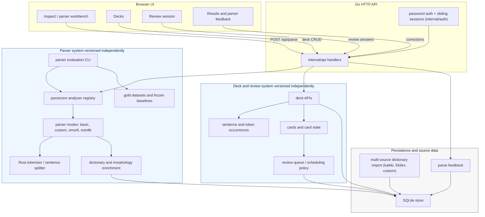

# FinEstDB Architecture

_Current as of 2026-05-07 — see [docs/CHANGELOG.md](docs/CHANGELOG.md) for revisions._

Role-aware Finnish and Estonian reading app focused on dictionary-backed
lemmatization, deck creation, review, parser feedback, and parser evaluation.

Subsystem behavior versions are tracked separately in
[`docs/SYSTEM_VERSIONING.md`](docs/SYSTEM_VERSIONING.md). Parser behavior,
parser baselines, and deck review scheduling should not share a single version
number because they change independently.

## What Exists Today

Current product surface on `main`:

- public landing/about/sign-in routes
- real password-based auth: Argon2id hashing + DB-backed sliding sessions in
  `internal/auth`, plus `/admin/users` administration page
- authenticated dashboard, Inspect, Decks, Review, and Results routes
- admin-only parser workbench and feedback routes
- Inspect page for Finnish or Estonian text
- parser selection in the admin workbench: `basic` and `custom`
- file load support for `.txt` / `.md`
- hybrid language policy: high-confidence paste/file ingest auto-switches the
  selector, detected FI/ET mismatches block parse until explicit switch, and
  unknown-language warnings remain advisory
- results page with sortable output, POS filter chips, coverage gauge, and parse duration
- structured parse-stage stats returned from `parsecore` and `/api/parse`
- deck, known-word, review, and parse-feedback APIs
- parser evaluation CLI for `basic`, `custom`, `omorfi`, and `estnltk`
- dataset-driven evaluation workflow in `internal/eval`
- expanded Finnish and Estonian gold datasets under `testdata/parser-eval/*/gold`
- external-adapter slots in `internal/parsecore` for the Omorfi (FI) and
  EstNLTK/Vabamorf (ET) baselines, with per-parser configurable subprocess
  timeouts
- multi-source dictionary tables: row-level `source` + `source_priority` on
  `lemmas` and `forms`; conflict resolution favors higher priority
- lexical-enrichment schema groundwork on `lemmas`/`forms`: `paradigm_class`
  (FI Kotus class join key), `feats` (UD-style morph features as JSON),
  plus dedicated `translations` and `definitions` tables
- Estonian source-data pipeline end-to-end: `cmd/fetchekilex` resumable
  scraper → `cmd/reduceekilex` golden-tested reducer → tracked CC BY 4.0
  artifacts under `localdata/ekilex/` (~177k headwords) → loaded into the
  dictionary tables by `cmd/importekilexdetails` (~178k lemmas, ~6.2M
  form rows, ~15s wall time)
- multi-lemma `forms` PK `(form, lang, lemma, pos)`: a single ambiguous
  surface form (e.g. ET `joon` = noun "line" + 1Sg of `jooma`) maps to
  multiple `(lemma, pos)` candidates; deck ingest emits one card per
  candidate
- Playwright coverage for parse/results, POS filtering, language switching, file upload, and mobile nav

Important distinction:

- `basic` and `custom` are admin workbench parser modes in the browser UI
- `omorfi` and `estnltk` exist today as evaluation/parser-core integration
  points, but not as browser buttons
- The Finnish lexical pipeline (Kotus + generated morphology tables +
  kaikki.org) is documented in [`docs/LEXICAL_PLAN.md`](docs/LEXICAL_PLAN.md).
  `cmd/importkotus` is present; production generated FI/ET morphology
  tables are still deferred beyond the current smoke fixtures.

## High-Level Architecture



```text
CURRENT

+--------------------------------------------------------------------------------+
| Browser UI                                                                     |
| web/index.html + web/app.ts                                                    |
|                                                                                |
| - Workbench nav shell                                                          |
| - Parse Text page                                                              |
| - Parser buttons: basic, custom                                                |
| - Language auto-switch, warning, and file load                                 |
| - Results table, POS filter chips                                              |
| - Coverage gauge and parse duration                                            |
+-----------------------------------+--------------------------------------------+
                                    |
                                    | POST /api/parse
                                    v
+--------------------------------------------------------------------------------+
| Go HTTP Server                                                                 |
| cmd/server + internal/api                                                      |
|                                                                                |
| Active user-facing flow:                                                       |
| - serve static frontend                                                        |
| - validate parse request                                                       |
| - call parsecore.Analyze(...)                                                  |
| - return JSON parse result plus parse stats                                    |
|                                                                                |
| Real auth surface (internal/auth):                                             |
| - /api/auth/register, login, logout                                            |
| - sliding sessions in user_sessions                                            |
| - /admin/users management                                                      |
|                                                                                |
| Partial / not current UI focus:                                                |
| - /api/decks                                                                   |
| - review scheduling endpoints                                                  |
+-----------------------------------+--------------------------------------------+
                                    |
                                    | parsecore.Analyze(db, lang, text, parser)
                                    v
+--------------------------------------------------------------------------------+
| Parse Core                                                                     |
| internal/parsecore                                                             |
|                                                                                |
| Shared parser orchestration layer:                                             |
| - request validation                                                           |
| - parser registry                                                              |
| - parser definitions                                                           |
| - sentence/token conversion                                                    |
| - dictionary resolution                                                        |
| - gloss lookup                                                                 |
| - word aggregation                                                             |
| - parse-stage observability metrics                                            |
|                                                                                |
| Parsers currently wired in:                                                    |
| - basic   -> Rust analyzer + direct dictionary lookup                          |
| - custom  -> Rust analyzer + fallback enrichment rules                         |
| - omorfi  -> external Finnish adapter slot + override rules                    |
| - estnltk -> external Estonian adapter (EstNLTK / Vabamorf)                    |
+--------------------------+--------------------------+--------------------------+
                           |                          |
                           | FFI                      | forms/lemmas/glosses
                           v                          v
+--------------------------------+      +----------------------------------------+
| Rust Parser Library            |      | SQLite + Dictionary Data               |
| parser/src/lib.rs              |      | internal/store                         |
|                                |      |                                        |
| - NFC normalization            |      | - forms / lemmas (source priority,     |
| - sentence splitting           |      |   paradigm_class, feats)               |
| - tokenization                 |      | - translations / definitions           |
| - heuristic POS guessing       |      | - dict_metadata (per-source provenance)|
|                                |      | - users / user_sessions                |
|                                |      | - decks / sentences / occurrence       |
|                                |      | - cards / card_state                   |
+--------------------------------+      +----------------------------------------+


CURRENT EVALUATION PATH

+--------------------------------------------------------------------------------+
| Parser Evaluation CLI                                                          |
| cmd/parsertest                                                                 |
|                                                                                |
| - load dataset JSON                                                            |
| - choose parsers (basic, custom, omorfi, estnltk)                              |
| - run warmup/timed evaluation                                                  |
| - write JSON report under reports/parser-eval                                  |
+-----------------------------------+--------------------------------------------+
                                    |
                                    v
+--------------------------------------------------------------------------------+
| Evaluation Engine                                                              |
| internal/eval                                                                  |
|                                                                                |
| - dataset loading and validation                                               |
| - token-by-token comparison                                                    |
| - lemma/POS/grammar/full accuracy                                              |
| - resolved coverage                                                            |
| - timing summaries                                                             |
| - parse-stage stats in case reports and summaries                              |
| - priority regression detection                                                |
+-----------------------------------+--------------------------------------------+
                                    |
                                    v
+--------------------------------------------------------------------------------+
| Evaluation Data                                                                |
| testdata/parser-eval                                                           |
|                                                                                |
| - Finnish gold sets                                                            |
| - Estonian gold sets                                                           |
| - annotation notes                                                             |
+--------------------------------------------------------------------------------+


FUTURE / PLANNED

.................................... parser quality loop ........................
. annotated datasets                                                          .
. stronger parser scoring                                                     .
. easier local regression checks                                              .
...............................................................................

.................................... lexical knowledge layer ...................
. self-improving dictionary / provenance-aware lexical store                  .
. richer lexical relations and better definition maintenance                  .
...............................................................................

.................................... later product work ........................
. accounts                                                                    .
. known-word tracking                                                         .
. dashboard and review scheduling                                             .
. learning flows built on stronger parser output                              .
...............................................................................
```

## Responsibilities By Layer

### 1. Browser UI

Files:

- `web/index.html`
- `web/app.ts`
- `web/app.js`
- `web/styles.css`

Responsibilities:

- render the workbench nav shell and mobile menu
- collect text and selected language
- choose between `basic` and `custom`
- submit parse requests to `/api/parse`
- render parser metadata, coverage gauge, POS filters, and sortable results
- explain coverage score and timing

### 2. API Layer

Files:

- `cmd/server/main.go`
- `internal/api/handlers.go`
- `internal/auth/` — password hashing, session creation/validation,
  registration, admin user management

Responsibilities:

- start the HTTP server with `Cache-Control: no-store` on static assets
- initialize SQLite-backed store
- expose parse, deck, review, and parse-feedback endpoints
- expose real password-based auth (`/api/auth/register`, login, logout)
  with Argon2id hashing and DB-backed sliding sessions (7-day expiry)
- pass parse work into `internal/parsecore`

### 3. Parse Core

Files:

- `internal/parsecore/parsecore.go`

Responsibilities:

- define parser result types
- maintain parser registry
- unify parser behavior behind one API
- enrich parser output with dictionary/gloss data
- support both browser parsing and CLI evaluation

### 4. Rust Parser

Files:

- `parser/src/lib.rs`
- `internal/parserffi/bindings.go`

Responsibilities:

- normalization
- sentence splitting
- tokenization
- heuristic POS guessing
- JSON/FFI bridge into Go

### 5. Dictionary / Persistence

Files:

- `internal/store/db.go` — schema + `EnsureXxx` migration helpers
- `internal/store/dict.go` — `BatchLookupForms`, `BatchLookupAllForms`
  (multi-lemma), `BatchLookupGlosses`, Finnish possessive stripping
- `cmd/importdict/` — kaikki.org JSONL or Ekilex API → SQLite (chooses
  shape via `-source-key`)
- `cmd/importekilex/` — compact Ekilex public-headword snapshot loader
- `cmd/importekilexdetails/` — loads the reduced Ekilex data drop
  (`localdata/ekilex/{definitions,forms}/`) into the dictionary tables;
  ~178k lemmas + ~6.2M form rows
- `cmd/importkotus/` — Kotus sanalista TSV → SQLite, populates `paradigm_class`
- `cmd/fetchekilex/` — resumable Ekilex `/api/word/details` scraper
- `cmd/reduceekilex/` — reduces raw payloads into sharded JSONL + TSV
  artifacts, with golden tests covering all 41 Estonian inflection classes
- `cmd/genlemmatizertables/` — generates the FI lemmatizer JSON tables
  under `localdata/lemmatizer-fi-et/tables/` from a local libvoikko
  `mor.vfst` (no transducer blob committed)
- `cmd/fetchfrequency/` — downloads public FI/ET frequency baselines
  (OpenSubtitles + UD treebanks) into `localdata/frequency/` for
  comparison against user-aggregated frequency

Responsibilities:

- import dictionary data from multiple sources (kaikki.org, Ekilex,
  custom CSV overrides) and store it with row-level `source` and
  `source_priority` for deterministic conflict resolution
- preserve per-source attribution metadata (`source_name`, `source_url`,
  `source_version`, `license`, `attribution`, `imported_at`,
  `changes_note`) in `dict_metadata`
- resolve forms to lemma/POS (multi-lemma aware via the
  `(form, lang, lemma, pos)` PK), applying Finnish possessive stripping
  and language-specific case-suffix fallbacks
- supply glosses (today from `lemmas.gloss`; Phase 2 of the FI plan
  moves them into `translations` and `definitions`)
- maintain Finnish-specific lexical-enrichment columns
  (`lemmas.paradigm_class`, `forms.feats`) and the new `translations` /
  `definitions` tables
- store deck/sentence/occurrence/review data; deck ingest expands a
  single ambiguous surface form into one occurrence/card per dict
  `(lemma, pos)` candidate
- own user authentication state via `users` and `user_sessions`

#### Multi-lemma forms

The `forms` table uses `PRIMARY KEY (form, lang, lemma, pos)` so a single
surface form can map to multiple `(lemma, pos)` candidates. This models
homonyms — e.g. ET `joon` is both the noun "line" (`SgN` of `joon`) and
the 1st-person-singular form of the verb `jooma` ("to drink"). At deck
ingest time, every dict candidate becomes its own `occurrence` row and
its own card; the parser's single pick is only used when the dict has
no entries for the form.

The corresponding `occurrence` UNIQUE is
`(deck_id, sentence_id, token_ix, lemma, pos)`. Migration from the legacy
single-lemma schema is handled by `EnsureMultiLemmaSchema` in
`internal/store/db.go`.

#### POS mapping (Ekilex → UPOS)

`cmd/importekilexdetails` translates Ekilex meaning-level POS codes (and
falls back to entry-level `word_class` when the meaning has no POS) into
Universal POS codes the parser pipeline emits. The mapping:

| Ekilex `meaning.pos` | UPOS | Notes |
|---|---|---|
| `s` | `NOUN` | substantive |
| `v`, `vrm` | `VERB` | `vrm` is rare |
| `adj`, `adjg`, `adjid` | `ADJ` | |
| `adv` | `ADV` | |
| `prop`, `propgen` | `PROPN` | proper noun |
| `pron` | `PRON` | |
| `num` | `NUM` | |
| `postp`, `prep` | `ADP` | |
| `konj` | `CCONJ` | no C/S split visible in data |
| `interj` | `INTJ` | |

Fallback when `meaning.pos` is empty (uses entry-level `word_class`):

| `word_class` | UPOS |
|---|---|
| `noomen` | `NOUN` |
| `verb` | `VERB` |
| `muutumatu` | `X` |

Forms in `forms/<letter>.tsv` carry only `(lemma, form, morph_code)` —
they don't say which homonym a form belongs to. When a lemma has multiple
homonyms with different POS (e.g. `jooma` is both VERB and NOUN), the
importer disambiguates by classifying the morph code: codes prefixed
`Ind/Imp/Knd/Kvt/Sup/Pts/Inf/Ger/Neg` are verbal and only attribute to
VERB; codes prefixed `Sg/Pl` (and the invariant marker `ID`) are nominal
and only attribute to non-VERB POSes.

### 6. Evaluation Stack

Files:

- `cmd/parsertest/main.go` — runs gold datasets across selected parsers
- `cmd/parser-compare/main.go` — assembles markdown comparison tables
  from one or more `cmd/parsertest` reports
- `cmd/importud/main.go` — converts Universal Dependencies CoNLL-U files
  into our parser-eval gold JSON; drives Plan C / PR 1 corpus expansion
- `cmd/corpusmine/main.go` — mines cleaned corpus text for
  disagreement-heavy gold candidates
- `cmd/autoresearch/main.go` — automated rule-ablation loop driven by
  parser-eval; logs accepted/rejected mutations to JSONL
- `scripts/fetch-and-import-ud.sh` — clone UD treebanks and run importud
- `scripts/parser-comparison.sh` · `scripts/parser-comparison-et.sh` —
  always include the analyzer baseline (omorfi/estnltk); fail fast when
  missing
- `cmd/scrapegutenberg/main.go` — Plan C / PR 3 silver-corpus scraper
  for Project Gutenberg Finnish books
- `internal/eval/eval.go`
- `testdata/parser-eval/{fi,et}/gold/` — committed gold (FI UD CC BY,
  manual sets, fi-grammar-v1)
- `localdata/parser-eval/{fi,et}/{gold,gold-train}/` — gitignored
  parser-eval gold for sources we can't redistribute (NC-licensed ET UD
  dev/test) and for splits we just don't want auto-discovered (FI/ET
  UD train splits, used for OOV/coverage only). All under localdata/
  per the single-folder bootstrap rule.
- `localdata/silver-fi/` — Plan C silver-tier corpus (Gutenberg-FI raw text
  + JSONL manifest); morphological annotation deferred to PR 4
- `docs/baselines/` — frozen baseline reports per parser/language
- `docs/PARSER_EVAL_DATASETS.md`
- `docs/OMORFI_ADAPTER.md` · `docs/OMORFI_COMPARISON.md`
- `docs/AUTORESEARCH.md`

Responsibilities:

- compare parser outputs on labeled datasets
- mine cleaned corpus text for disagreement-heavy candidate sentences
- record quality, observability, and performance metrics
- detect regressions and priority failures
- provide the workflow for judging parser improvements

Held-out discipline (introduced 2026-05-06c, Plan C / PR 1):

- Every committed comparison report must include the analyzer baseline
  column (omorfi for FI, estnltk for ET); see "Eval harness parity"
  in `docs/CHANGELOG.md`
- Default discovery in the comparison scripts excludes `*-dev-*` files
  (used for per-commit watching, not headline eval) and `gold-train/`
  files (used for OOV / coverage analysis only)
- UD test sets are the held-out anchor; manual / fi-grammar-v1 / etc.
  are curated adversarial sets retained alongside

UD-derived gold (Plan C / PR 1, paths consolidated 2026-05-07):

Committed FI test/dev gold lives under `testdata/parser-eval/fi/gold/`.
Everything else (FI/ET train splits, NC-licensed ET UD dev/test) lives
under `localdata/parser-eval/{fi,et}/{gold,gold-train}/` so the entire
gitignored bootstrap state fits in a single zip of `localdata/`.

| Treebank      | License        | Test cases | Dev cases | Train cases | Gold JSON                                                                       |
|---------------|----------------|-----------:|----------:|------------:|---------------------------------------------------------------------------------|
| Finnish-TDT   | CC BY-SA 4.0   |     1,554  |    1,358  |     12,204  | committed: `testdata/parser-eval/fi/gold/ud-fi-tdt-{test,dev}-v1.json`; train at `localdata/parser-eval/fi/gold-train/ud-fi-tdt-train-v1.json` |
| Finnish-FTB   | CC BY 4.0      |     1,867  |    1,875  |     14,972  | committed: `testdata/parser-eval/fi/gold/ud-fi-ftb-{test,dev}-v1.json`; train at `localdata/parser-eval/fi/gold-train/ud-fi-ftb-train-v1.json` |
| Finnish-PUD   | CC BY-SA 3.0   |     1,000  |        — |          — | committed: `testdata/parser-eval/fi/gold/ud-fi-pud-test-v1.json`               |
| Finnish-OOD   | CC BY-SA 4.0   |     2,106  |        — |          — | committed: `testdata/parser-eval/fi/gold/ud-fi-ood-test-v1.json`               |
| Estonian-EDT  | CC BY-NC-SA    |     3,190  |    3,110  |     24,419  | local-only: `localdata/parser-eval/et/gold/ud-et-edt-{test,dev}-v1.json` + `localdata/parser-eval/et/gold-train/ud-et-edt-train-v1.json` |
| Estonian-EWT  | CC BY-NC-SA    |       910  |      823  |      5,375  | local-only: `localdata/parser-eval/et/gold/ud-et-ewt-{test,dev}-v1.json` + `localdata/parser-eval/et/gold-train/ud-et-ewt-train-v1.json` |

About 776k gold tokens locally (FI committed test/dev + everything
else under localdata/). Run `make import-ud-gold` after a fresh
checkout to materialize the local files. See
[`docs/data_enhancement.md`](docs/data_enhancement.md) for the
single-source-of-truth ledger of every gold/silver corpus.

## Lexical Pipelines

The two languages stitch together different source mixes behind the same
multi-source schema. See [`docs/LEXICAL_PLAN.md`](docs/LEXICAL_PLAN.md)
for the combined FI + ET lexical-layer architecture (Estonian-specific
content lives there now; the legacy `docs/ESTONIAN_LEXICAL_PLAN.md` was
deleted in PR #135).

Estonian (live):

- analyzer baseline: EstNLTK / Vabamorf via the `estnltk` adapter
- lexical sources: kaikki.org (priority 10) + EKI/Ekilex (priority 20)
- Ekilex bulk path: `cmd/fetchekilex` → `cmd/reduceekilex` → tracked
  sharded artifacts in `localdata/ekilex/` → loaded by
  `cmd/importekilexdetails` (multi-lemma aware, with morph-class
  homonym disambiguation and `(lemma, pos)` gloss merging)
- Ekilex API path (smaller queries, on-demand): `cmd/importdict
  -source-key ekilex` against the `/api/word/details` endpoint

Finnish (Phases 1–3 shipped, Phase 4 superseded by FST runtime, Phase 5 partially shipped):

- analyzer baseline: Omorfi adapter slot
- lexical sources: kaikki.org (priority 20) + Kotus sanalista (priority 10,
  fills `paradigm_class`)
- generated morphology tables: `pkg/lemmatizer-fi-et/` reads JSON tables
  from `localdata/lemmatizer-fi-et/tables/` (gitignored per
  `docs/ARTIFACT_POLICY.md`); production tables generated locally by
  `make gen-lemmatizer-tables-fi VFST_PATH=/path/to/mor.vfst` from a
  user-installed libvoikko. Smoke-fixture tables ship under
  `testdata/lemmatizer/` for tests; runtime falls back to dict-only when
  production tables are absent.
- post-#127/#129/#130 the FST is a parallel scorer in dict step 1 with
  candidate-merge FEATS enrichment, no longer a step-5 fallback.

## Parser Modes and Baselines

### Browser-exposed modes

- `basic`
  - Rust parse
  - direct dictionary lookup only
  - unresolved tokens fall back to stub lemma/POS

- `custom`
  - Rust parse
  - dictionary lookup with parallel-FST candidate scoring (post-#127)
    and FST candidate-merge FEATS enrichment (post-#129)
  - Finnish possessive stripping
  - Finnish/Estonian compound splitting
  - Finnish/Estonian case-suffix fallback rules
  - case-suffix grammar-label stopgap on dict hits (`attachCaseLabelIfStemMatches`,
    transitional until production FST tables emit FEATS for direct hits)

### Evaluation-only baseline path

- `omorfi`
  - Finnish only
  - configured through `FINNESTDB_OMORFI_CMD`
  - external adapter slot, not bundled runtime
  - useful for comparison against `basic` and `custom`

- `estnltk`
  - Estonian only
  - configured through `FINNESTDB_ESTNLTK_CMD` (or autodiscovered from
    `scripts/estnltk_adapter_example.py`)
  - subprocess timeout overridable via `FINNESTDB_ESTNLTK_TIMEOUT`
  - same JSON shape as the Rust FFI parser; comparison-only, not a
    browser button

## Data Flow

### User-facing parse flow

1. User submits Finnish or Estonian text in the browser.
2. Frontend calls `POST /api/parse`.
3. API handler calls `parsecore.Analyze(...)`.
4. `parsecore` picks the requested parser.
5. Rust or external analyzer returns token-level analysis.
6. `parsecore` resolves forms via dictionary/enrichment logic.
7. `parsecore` aggregates words, glosses, grammar labels, and examples.
8. API returns parse JSON and parse-stage stats to the browser.
9. Frontend renders summary stats, coverage gauge, POS-filtered rows, and sortable output.

### Evaluation flow

1. Developer runs `go run ./cmd/parsertest ...`.
2. Dataset JSON is loaded and validated.
3. Each parser is run across each case with warmup and timed repeats.
4. Output is compared against expected token annotations.
5. Accuracy, coverage, and parse-stage observability metrics are written to a report JSON file.

## Current Boundaries and Caveats

- The browser UI is still centered on `basic` and `custom`.
- The nav shell is intentionally limited to the parser workbench surface.
- Auth is real (Argon2id + DB-backed sessions), but the review/scheduling
  flows on top still have partial scaffolding.
- Omorfi and EstNLTK are not bundled into normal app startup; they are
  external adapter paths used only by the evaluation CLI.
- The evaluation pipeline is now a first-class architectural component.
- The Finnish lexical pipeline columns are populated:
  `paradigm_class` is set on FI lemmas by `cmd/importkotus` (Phase 3),
  `forms.feats` is populated by `cmd/importdict` (FI/ET kaikki, via
  `kaikkiTagsToFeats` since 2026-05-07k / PR #139),
  by `cmd/importekilexdetails` (ET, via Ekilex morph_code), and by FST
  candidate merge in `BatchLookupForms` (post-#129).
  `translations` and `definitions` are populated by `cmd/importdict`
  (kaikki) and `cmd/importekilexdetails` (Ekilex) per Phase 2.
  The case-suffix-strip fallback path projects `Case=` into `feats`
  via `featsFromCaseLabel` so even that resolution path emits FEATS.
  The shared composer `pkg/lemmatizer-fi-et/udfeats::Compose` is the
  canonical FEATS-string assembler; FST analyses persist `Analysis.Feats`
  at parse time so generated tables are self-describing on disk.
  Production FI lemmatizer tables (the local `localdata/lemmatizer-fi-et/`
  artifact) are generated locally by users; the runtime falls back to
  dict-only when they are absent.

## Near-Term Direction

The intended sequence from the current codebase is:

1. narrow or remove non-parser backend stubs that do not match the workbench product focus
2. strengthen parser evaluation with more reviewed Finnish and Estonian gold data
3. use eval regressions and observability metrics to drive targeted parser fixes
4. compare custom rules against the Omorfi (FI) and EstNLTK (ET) baselines
5. continue the lexical pipelines:
   - **ET**: production Estonian lemmatizer-table generator — analogous
     to `cmd/genlemmatizertables` for FI, sourcing local Giellalt/HFST
     analyses. Until then, ET FST is disabled at runtime (dict-only path
     runs).
   - **FI**: production FI lemmatizer-table generation against a real
     word list (current `cmd/genlemmatizertables/wordlists/fi_smoke.txt`
     ships as a smoke fixture). Phases 1–3 of
     [`docs/LEXICAL_PLAN.md`](docs/LEXICAL_PLAN.md) shipped (Kotus,
     translations migration, kaikki tagging). Phase 4 (Voikko offline
     seed) was superseded by the FST runtime path; Phase 5 (production
     ET tables) is the remaining work →
     resolution priority flip
6. return later to known-word tracking and review-flow polish
