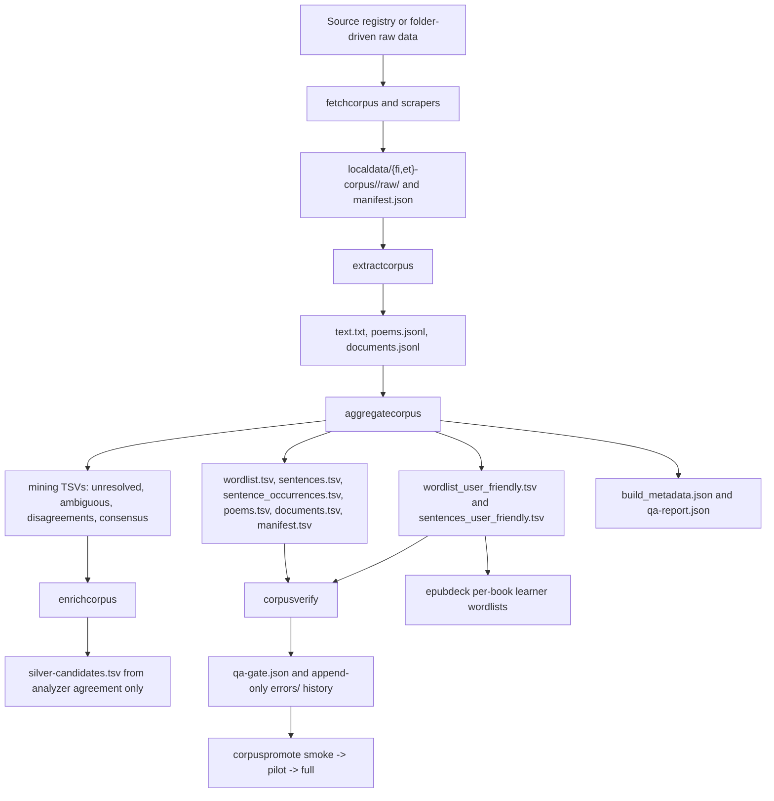

# Corpus pipeline — operator manual

Reference card for the corpus pipeline that lives at
`corpus_pipeline/`. All paths are relative to the main
finnestdb repo's `localdata/` directory.

The pipeline source is tracked so agents and humans share one reproducible
implementation. Corpus data remains local-only under `localdata/`. See
[`DECISIONS.md`](DECISIONS.md) for the rationale and report policy. See
[`PR_ROADMAP.md`](PR_ROADMAP.md) for the near-term PR sequence and the
reason each planned schema/export change exists.

---

## Architecture in 30 seconds



---

## Quick reference — every make target

Run from `cd corpus_pipeline/`. The core fetch/extract/aggregate/verify/
promote/enrich/gloss targets have `-fi`, `-et`, and no-suffix (= both)
variants. Source-specific helpers such as `scrape-riigikogu` document
their own language scope.

| Target | What | When to run | Wall clock | Outputs |
|---|---|---|---|---|
| `make build` | `go build ./...` | After code edits | <5 s | binaries cached |
| `make fetch-corpus[-fi/-et]` | Download all registered sources to `raw/` | When sources change or you want a refresh | ~2-30 min depending on registry size | `<source>/raw/*` + `.sha256` sidecars |
| `make fetch-corpus-dry-run` | HEAD probe each URL without downloading | Verifying URLs before a real fetch | <1 min | stderr report |
| `make extract-corpus[-fi/-et]` | Walk all sources, run format-specific extractor | After fetch, or when extractors change | ~1-5 min for all | `<source>/text.txt` (prose) or `poems.jsonl` (poetry) + `documents.jsonl` |
| `make aggregate-corpus[-fi/-et]` | 4-phase aggregation → canonical and user-facing derived TSVs + QA report | After extract | ~minutes for smoke, ~hours for full | `_derived/*.tsv` + `_derived/mining/*.tsv` + JSON metadata |
| `make corpus-verify[-fi/-et] PROFILE=…` | Hard/soft gate check, exit nonzero on fail | After aggregate | <5 s | `_derived/qa-gate.json` (+ `errors/` on fail) |
| `make corpus-promote[-fi/-et] PROFILE=…` | Chain extract→aggregate→verify; smoke→pilot→full ladder | When advancing through profiles | depends on profile | promotion-state.json updated |
| `make corpus-cache-clear` | Wipe `_derived/cache/` when present | After parser/dict changes or cache experiments | <1 s | clears cache if it exists |
| `make bootstrap-tarball` | 3-way split tarball (code, fi, et) — lean recipe excludes raw/text/scratch/cache | Before handoff to another machine | ~30-45 min serial, less in parallel | `finnestdb-bootstrap-{code,fi,et}.tgz` in `localdata/bootstraps/` (~25 GB total compressed). See "Bootstrap tarballs" section below |
| `make gloss-coverage[-fi/-et]` | Audit dict-DB gloss coverage against the wordlist (pair + token-weighted) | Before/after a meaning-source import | <30 s | `reports/<date>-coverage-{lang}.json` |

The `PROFILE` Makefile variable defaults to `smoke`. Override with
`PROFILE=pilot` or `PROFILE=full`.

Migration note: `corpus-verify` requires `_derived/sentences_user_friendly.tsv`.
Existing `_derived/` directories built before that export existed must rerun
`make aggregate-corpus[-fi|-et]` before verify will pass.

---

## Profiles

| Profile | Data slice | Purpose |
|---|---|---|
| `smoke` | Hand-authored fixture (`testdata/corpus-fixtures/{fi,et}/`) + tiny real source. Probes verify FI `Tulen -> tulla/VERB`, FI `Talossa -> talo/Ine`, FI `Kuusen -> kuusi/Gen`, ET `joon` produces at least 2 analyses including `jooma/VERB`. | Fast architecture validation. Run after any code change. |
| `pilot` | Real-source slice. The 2026-05-08 pilot run covered 14 FI sources and 13 ET sources; see [`../reports/2026-05-08-pilot-complete.md`](../reports/2026-05-08-pilot-complete.md). | Full pipeline shape on real data, not toy fixtures. |
| `full` | Everything from the source registry and local folder-driven sources. | The actual corpus build. Expect large disk use and multi-hour wall clock; use pilot reports to estimate on the current machine. |

---

## Repair loop on hard-gate failure

`cmd/corpusverify` exits nonzero on hard-gate fail and writes:

- `_derived/qa-gate.json` — machine-readable gate results
- `_derived/errors/error_report.txt` — human-readable summary
- Appends to `_derived/errors/error-history.jsonl` (timestamped, append-only)

Workflow when you (or Claude) hit a hard fail:

1. **Read** `_derived/errors/error_report.txt` — names the specific gate that failed.
2. **Read** `_derived/qa-gate.json` — machine-readable detail.
3. **Diagnose**: extractor bug? Aggregator schema mismatch? Source data quirk?
4. **Fix** in `corpus_pipeline/` source.
5. **Append** a `repaired.jsonl` entry with `{utc, fix_id, error_class,
   original_error_utc, fix_description}` (omit `git_head_sha` —
   we're no-commit local).
6. **Restart**: `make corpus-promote-{fi|et}` resumes via
   `promotion-state.json` (skips passed profiles).
7. **Loop** until clean.

If a known `error_class` re-appears within ~7 days of a `repaired.jsonl`
entry, the verifier flags it as **regression** in the report — catches
silent reverts and pipeline drift.

---

## Cleanliness invariant

`corpus_pipeline/` is tracked source. Runtime corpus data is gitignore-only
under `localdata/`. After every session:

```sh
# from the repo root:
git status --porcelain | grep -v '^?? localdata/' | grep -v '^?? design/'
# expect: empty
```

The corpus pipeline should not create new tracked changes outside
`corpus_pipeline/` unless a PR explicitly says why. Pre-existing unrelated
state (`design/*` untracked, etc.) is fine — only the intended delta matters.

---

## Common operations

### Add a new source (URL-driven)

1. Add a `Source` entry to `cmd/fetchcorpus/sources_fi.go` (or `_et.go`):
   ```go
   {Slug: "opus-foo", Lang: "fi", Kind: "prose", Format: "gz",
    URL: "https://...", Filename: "fi.txt.gz", License: "..."},
   ```
2. `make fetch-corpus-fi -- -dry-run` to verify the URL.
3. `make fetch-corpus-fi` to actually fetch.
4. `make extract-corpus-fi aggregate-corpus-fi corpus-verify-fi`.

### Add a new source (folder-driven, e.g. EPUBs)

1. Drop files into `localdata/{lang}-corpus/<your-slug>/raw/`.
2. Write `localdata/{lang}-corpus/<your-slug>/manifest.json` with
   `format: epub` (or whatever).
3. `make extract-corpus aggregate-corpus`. (Skip fetch — folder-driven.)

### Add an EPUB to the existing FI corpus

```sh
cp ~/some-book.epub localdata/fi-corpus/epub/raw/
cd corpus_pipeline
make extract-corpus-fi aggregate-corpus-fi corpus-verify-fi
```

### Inspect the wordlist for a specific surface

```sh
awk -F'\t' '$1=="tulen"' localdata/fi-corpus/_derived/wordlist.tsv
```

### Top-N most-frequent prose surfaces

```sh
# (header is row 1, sort is by surface_count_prose desc)
tail -n +2 localdata/fi-corpus/_derived/wordlist.tsv | head -100
```

### Find unresolved high-frequency surfaces (parser-improvement priorities)

```sh
head -50 localdata/fi-corpus/_derived/mining/unresolved.tsv
```

### Recover an example sentence from the canonical wordlist

`wordlist.tsv` carries `example_ref_type` + `example_ref_id` only — the
example body is recoverable by joining against `sentences.tsv` (or
`poems.tsv` when `example_ref_type=poem`). The user-friendly export at
`wordlist_user_friendly.tsv` works the same way.

```sh
# Look up the example for a row whose example_ref_id is, say, 42
awk -F'\t' 'NR==1||$1=="42"' localdata/fi-corpus/_derived/sentences.tsv
```

Older wordlists shipped a denormalized `example_text` column; that was
removed because at full FI scale it accounted for the majority of
`wordlist.tsv` size for very little additional information.

### User-friendly wordlist (learner-facing)

`wordlist_user_friendly.tsv` is a derived export with the columns a UI
needs:

```
surface, meaning, lang, lemma, pos,
case, number, mood, tense, person, voice, verbform, feats,
surface_count_*, doc_count_*, source_counts_json,
analysis_sources, analysis_rank, is_parser_choice,
parser_version, fst_tables_sha, dict_fingerprint,
example_ref_type, example_ref_id
```

`meaning` is the dictionary gloss for `(lemma, pos)`. Empty when the
dictionary doesn't list the headword (~21% of FI tokens, ~21% of ET
tokens after the meaning-sources work). The morphology columns (case,
number, mood, etc.) are split out from `feats` so consumers don't have to
parse the pipe-delimited string themselves; `feats` itself remains for
completeness.

### Bootstrap tarballs (handoff to another machine)

The Makefile builds three split tarballs into
`localdata/bootstraps/`. They share a lean `BOOTSTRAP_EXCLUDES` list so
the canonical artifacts ship and the reproducible-from-source intermediates
don't:

```sh
cd corpus_pipeline
make bootstrap-tarball              # all three
make bootstrap-tarball-code         # finnestdb.db + dict sources + corpus_pipeline
make bootstrap-tarball-fi           # localdata/fi-corpus minus excludes
make bootstrap-tarball-et           # localdata/et-corpus minus excludes
```

**What ships** (intentional handoff payload):

- `_derived/` — wordlist.tsv, wordlist_user_friendly.tsv, wordlist-enriched.tsv,
  sentences.tsv, sentences_user_friendly.tsv, sentence_occurrences.tsv,
  documents.tsv, manifest.tsv, poems.tsv
- `_derived/mining/` — silver-candidates, parser-disagreements,
  internal-consensus-candidates, high-frequency-ambiguous, unresolved,
  poetry-unresolved
- `_derived/build_metadata.json`, `qa-report.json`, `qa-gate.json`
- Per-source `manifest.json` (~300 B each) and `documents.jsonl`
  (provenance — needed to resolve `documents.tsv` rows back to their
  raw source location)
- The `code` tarball additionally ships `finnestdb.db`,
  `localdata/lemmatizer-fi-et/`, `localdata/ekilex/`, `localdata/kaikki/`,
  and the entire `corpus_pipeline/` Go module + scripts.

**What's excluded** (large + reproducible from source):

- `_derived/_scratch.db` + WAL/SHM (deleted after each aggregate; up to 36 GB during a run)
- `_derived/cache/` (parser cache — auto-rebuilds)
- per-source `raw/` (50+ GB FI; re-fetch via `cmd/fetchcorpus`)
- per-source `text.txt` (regenerate via `cmd/extractcorpus`)
- `epub/per-book/`, `epub/decks/` (EPUB-specific intermediates)
- `<source>/poems.jsonl` (poetry sources — empty for FI/ET v1)
- `.DS_Store`

The exclude list lives in `Makefile` under the `BOOTSTRAP_EXCLUDES` variable.
Update it there if a new intermediate gets added that shouldn't ship.

**Sizing (post-2026-05-11 lean recipe):**

| Tarball | Source size | Compressed |
|---|---:|---:|
| code | ~6.5 GB | ~2 GB |
| fi | ~24 GB | ~10-15 GB |
| et | ~22 GB | ~10-12 GB |
| **Total** | **~52 GB** | **~25 GB** |

Each tarball takes ~10-20 min to build serially. Run in parallel with
`make -j3 bootstrap-tarball` if disk + CPU can absorb three concurrent
gzip streams.

**After building, record sha256 sidecars** so the receiving side can verify:

```sh
cd localdata/bootstraps
for f in *.tgz; do shasum -a 256 "$f" > "$f.sha256"; done
```

A reference manifest with sha256/size/row-count for every derived artifact
from the 2026-05-11 build is at
`notes/2026-05-11-derived-artifacts-manifest.md` (with per-file dumps in
sibling `*-checksums.txt`).

---

## Architecture decisions enforced

These are the v1 decisions baked into the code. Don't change them lightly:

1. **Phase 1 uses `parserffi.AnalyzeText`**, not `parsecore.Analyze` (avoids dictionary lookup + 300K char limit during cheap counting).
2. **Phase 2 uses `parsecore.Analyze` + `Lemmatizer.Lemmatize`** for parser_choice + multi-FST analyses on each unique surface.
3. **Wordlist rows collapse on identical (lemma, pos, feats)** across analysis sources. `analysis_sources` is `;`-joined.
4. **Default sort: `surface_count_prose` desc, then `surface_count_total` desc.** Poetry counts visible but not rank-dominant.
5. **Poetry sources contribute to surface counts** (in a separate column), they're not silently dropped.
6. **Deterministic sentence IDs** assigned in phase 4 by sorting first-occurrence (source, document_id, sentence_ix, hash).
7. **Lang code normalization at the boundary**: lowercase for paths/TSV, uppercase for parser/FST.
8. **Dictionary DB preflight uses real schema**: `forms`, `lemmas`, `dict_metadata` tables; counts > 0 for target lang.
9. **`silver-candidates.tsv` is enrichcorpus-only.** `aggregatecorpus` never writes it. Verifier rejects if aggregator emitted rows.
10. **Module path** is `finnestdb/corpus_pipeline` (Go internal/ visibility).

---

## Built vs deferred

See [`../v2plan.md`](../v2plan.md) for the deferred-items ledger with
trigger conditions, and [`PR_ROADMAP.md`](PR_ROADMAP.md) for the PR
sequence. The living status as of 2026-05-09:

Built:

- Source fetching, source manifests, checksum sidecars, and dry-run URL probes.
- Extractors for fixture, gzip/plain text, EPUB, VRT, Leipzig, CSV, SKVR,
  HTML, Hugging Face, Markdown, and miscellaneous text sources, plus the
  Riigikogu scraper path.
- Canonical and learner-facing exports:
  `wordlist.tsv`, `wordlist_user_friendly.tsv`, `sentences.tsv`,
  `sentences_user_friendly.tsv`, `sentence_occurrences.tsv`, poems,
  documents, manifest, build metadata, and QA report.
- Mining exports for unresolved surfaces, poetry-heavy unresolved forms,
  parser disagreements, high-frequency ambiguous forms, and internal
  consensus candidates.
- `cmd/enrichcorpus`, `cmd/epubdeck`, and `cmd/glosscoverage`.
- Smoke/pilot/full promotion machinery with hard/soft QA gates and
  append-only error history.

Still deferred or trigger-gated:

- SQLite scratch DB + concurrent worker pool. Add this when full corpus
  aggregation OOMs or memory profiling shows the in-memory aggregator is
  the blocker.
- More production source expansion and source-specific polish. Add sources
  when a license, format, and learner value are clear.
- App ingestion of promoted corpus artifacts. The exports are designed for
  it, but the browser app still treats the corpus pipeline as offline data
  production.
- Scheduled refresh/retention policy for user-generated corpus material.
  This belongs with go-live privacy and abuse-control work, not with the
  offline public-source pilot.

---

## Troubleshooting

### "missing FST tables" hard fail at preflight

```
preflight.fst.missing: /…/localdata/lemmatizer-fi-et/tables/fi_min.json
```

The FST tables aren't in the expected path. Either:
- The table generator was never run for that language, OR
- `localdata/lemmatizer-fi-et/tables/` got moved/deleted, OR
- `LEMMATIZER_TABLES_DIR` env var override is wrong.

Fix: generate the missing local table from a local analyzer, then confirm
`localdata/lemmatizer-fi-et/tables/{fi,et}_min.json` exists and is
non-empty:

```sh
cd <repo-root>
make gen-lemmatizer-tables-fi VFST_PATH=/absolute/path/to/mor.vfst
make gen-lemmatizer-tables-et HFSTOL_PATH=/absolute/path/to/analyser-gt-desc.hfstol
```

`make parser` still matters for the Rust tokenizer shared library, but it
does not create production FST tables.

### "preflight.dict.missing_or_empty" hard fail

```
preflight.dict.missing_or_empty: forms has 0 rows for lang=FI
```

`finnestdb.db` was opened against a fresh/empty file. Either:
- `finnestdb.db` got deleted/moved, OR
- The `-db` flag points at the wrong path.

Fix: confirm `<repo-root>/finnestdb.db` exists, is multi-GB, and has
non-empty `forms` and `lemmas` tables for both FI and ET. If not, run
the main repo's `scripts/setup-local.sh` to rebuild.

### EPUB extractor fails on a specific book

```
[extract_epub] WARN: <book>.epub: <error>
```

Pure-Go zip + XHTML strip. If a book has unusual encoding (e.g. nested
zip, or DRM), it may fail. The book is logged and skipped — other books
continue. Failed-extraction books appear in stderr; check
`<source>/per-book/` for missing entries.

### Aggregator runs out of memory

```
runtime: out of memory
```

The v1 aggregator is in-memory. Trigger v2.4 (SQLite scratch DB +
concurrent workers). For now, work around by aggregating per-source:
`make aggregate-corpus-fi -- -only opus-tatoeba` etc.

### Pipeline runs but `wordlist.tsv` looks empty/wrong

Check `_derived/qa-report.json` totals — `unresolved_rate_prose` near
1.0 means the parser isn't resolving anything (FST tables missing? db
empty?). Also check `mining/unresolved.tsv` for what's slipping through.
