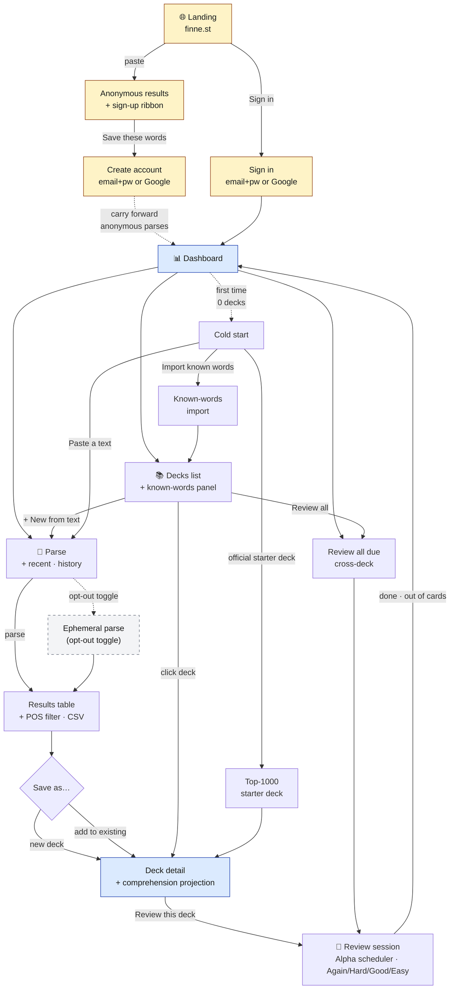
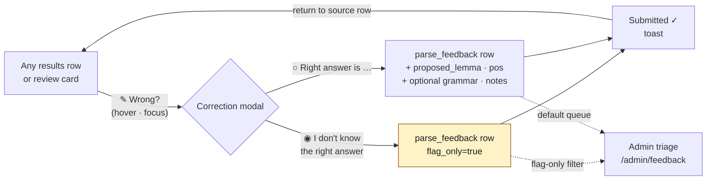

# FinnEst - Consumer User Flows

_Created 2026-05-07 from a working session. Captures the consumer-alpha
user journey at the screen level, calls out where it diverges from
what's currently on `main`, and proposes designs for the open questions
(landing screen, correction UX, deck cold-start)._

This document is a **product spec**, not an implementation plan. For the
sequenced engineering work see [`TODO.md`](../TODO.md). For the deck /
FSRS / coverage data model see [`srs-deck-spec.md`](srs-deck-spec.md).
For the alpha product framing see [`FEATURES.md`](FEATURES.md).

Status update, 2026-07-03: the current alpha posture is **anonymous parser demo
plus signed-in learning, with open signup**. Anonymous visitors can paste text,
parse it, get a word list, and explore that list. Open signup means learners
can create accounts without an invite or waitlist. Durable and personalized
actions require sign-in: save/deck/review, known/ignored state, imports, parser
feedback, history, and account settings. The signed-in first-session target is:
bring your own text or choose a curated embedded text, inspect the parse, then
either export/use the result or save a deck and start review. The embedded
catalog should ship as fast checked-in metadata plus lazy-loaded text fixtures:
load the catalog quickly, and load the full text only when the learner chooses
it.

Domain: **finne.st** (registered; not serving the app until go-live - do not
test against it, run a local server instead).

## Map of the flow



In words:

1. **Anonymous demo path**: paste text -> parse -> word list -> explore rows.
2. **First-session success**: the learner brings a text or chooses a curated embedded text,
   gets a useful parse, and leaves with a concrete next action: export/use the
   result, mark known/ignored words, submit correction feedback, or save a deck.
3. **Activation path**: parse → results → save (new deck OR add to existing) →
   deck detail → first review.
4. **Cold start**: a brand-new account with zero decks lands on the dashboard's
   empty state with three immediate paths: paste/upload a text, choose from the
   embedded catalog, or import known words. A fourth path shipped 2026-07-02:
   add the "Top 1000" official starter deck (operator-seeded from the
   OpenSubtitles baseline via `cmd/seedcolddeck`).
5. **Cross-cutting correction**: from any results row or review card, the `✎ Wrong?` icon opens a modal with two paths (flag-only or propose-fix) - see §10 below.
6. **Sign-up bridge**: anonymous results can show sign-in/sign-up CTAs for
   saving, decks, review, known-word state, imports, feedback, and history.
   Anonymous parses are ephemeral; nothing durable is stored until sign-up and
   explicit save/import actions.

Yellow nodes are anonymous-only. Dashed-border nodes are not yet built (opt-out ephemeral parse; the cold-start top-1000 node shipped 2026-07-02 as an official starter deck). Blue hub nodes are the highest-traffic surfaces.

## Screen-by-screen

### 1. Landing + inline parse (anonymous)

Status: shipped 2026-07-04. Re-skinned 2026-07-04 to the Claude Design "Aalto
edition" prototype (`design/aalto-landing.jsx`): the landing now leads with the
serif hero **"Learn in Context"**. Hovering _Finnish_ and _Estonian_ reveals
their italic-blue native names, _Suomi_ and _Eesti_. It has a truthful
eyebrow (`FREE · NO ACCOUNT · NO HISTORY SAVED` with a live pulse dot), the
birch-lined paste box, the "or try →" demo chips, a three-cell freemium band
(i. parse free / ii. copy or download / iii. save decks · sign in), and the
Aalto decoration (drifting Savoy-vase silhouette).
The Aalto skin (`data-skin="aalto"`, Paimio light) is now the product's default
face; the Ink skin stays selectable in the theme picker, and saved user choices
are always honored (only the fallback default changed - one line in
`readThemeSkin`/`readThemeMode` reverts it).

Anonymous users can paste text, parse it, get a word list, and explore rows
before signing in. This is a stateless parser demo, not the full learning
product. The paste box keeps its function (FI/ET selector, char counter against
the anonymous cap surfaced by `/api/me` `anon_max_chars`, Parse button with a
`⌘↵` hint); file upload stays a signed-in capability.

- **Demo chips** ("or try →") load three curated, license-clean embedded texts
  served anonymously: `FI · article` (Sauna), `FI · story` (Hiiri-Pekka), and
  `ET · story` (Linnu keel). They come from a fixed allowlist exposed via
  `GET /api/demo/text/{id}` - a stateless, unauthenticated endpoint restricted
  to those three ids (the full `/api/catalog` surface stays signed-in only, and
  any id outside the allowlist 404s, so the private catalog can't be enumerated).
  Clicking a chip fills the paste box, sets the FI/ET selector to the text's
  language, and scrolls the box into view; it does not auto-parse.
- **Word-list export** (freemium cell ii, "Copy or download") is available on
  the results view to everyone, anonymous included: **Copy list** (tab-separated
  lemma/POS/definition) and **Download CSV** are generated entirely client-side
  from the parse response already in memory, so they honor the anonymous
  ephemeral guarantee - no server round-trip, nothing stored. Everything else
  (save/deck/review/known-state/corrections) stays sign-in gated.
- The prototype's "Ephemeral OFF" toggle is deliberately **not** ported to the
  anonymous landing: anonymous parses are always ephemeral, so a toggle would be
  dishonest. The eyebrow states the ephemeral guarantee as plain fact.

```
┌────────────────────────────────────────────────────────────────┐
│  finne.st                                  [Theme] [Sign in]   │
├────────────────────────────────────────────────────────────────┤
│                                                                │
│      Read what you love in Finnish or Estonian.               │
│      Learn its words first.                                    │
│      Paste any text. See every word, what it means, and how    │
│      often it shows up - so you learn it before you read.      │
│                                                                │
│      ┌────────────────────────────────────────────────────┐    │
│      │ Language: [● Auto-detect  ○ FI  ○ ET]              │    │
│      │                                                    │    │
│      │ ┌─────────────────────────────────────────────┐    │    │
│      │ │ Paste a paragraph, an article, lyrics -     │    │    │
│      │ │ anything in Finnish or Estonian.            │    │    │
│      │ │                                             │    │    │
│      │ │                                             │    │    │
│      │ │                                             │    │    │
│      │ └─────────────────────────────────────────────┘    │    │
│      │                                                    │    │
│      │ File upload is available after sign-in             │    │
│      │                                                    │    │
│      │ ▽ Detected: Finnish · 4,213 chars · 612 tokens     │    │
│      │   · 287 unique forms · 0 numbers                   │    │
│      │                                                    │    │
│      │                              [ Parse text ► ]      │    │
│      └────────────────────────────────────────────────────┘    │
│                                                                │
│      How it works  ·  Privacy  ·  About                        │
└────────────────────────────────────────────────────────────────┘
```

**Behavior**
- Paste text. Anonymous alpha is paste-first; file upload remains a signed-in
  Inspect/workbench capability for `.txt`, `.md`, and `.epub`. Anki `.apkg`
  import is a separate known-words/import follow-up, not part of the current
  parse upload surface.
- The **stats strip under the textarea** (`Detected: ... · N chars · N
  tokens · ...`) is live, debounced. In the current signed-in alpha policy,
  high-confidence FI/ET mismatch warns and requires the learner to switch the
  language explicitly before parsing.
- Anonymous parsing uses a lower configurable text-size limit than signed-in
  parsing. Shipped: `FINNESTDB_ANON_MAX_CHARS` (default 300,000 characters),
  enforced server-side for unauthenticated `/api/parse` before any parser work
  and surfaced to the landing char counter via `/api/me` (`anon_max_chars`). The
  signed-in cap remains 1,500,000 characters. If an unsigned visitor exceeds the
  anonymous demo cap, the server returns a 4xx JSON error naming the limit and
  the client shows a clear limit message with a sign-up CTA for longer-text
  workflows. The default is a starting point to tune with the 1,000-concurrent
  load test.
- Anonymous parse runs **ephemerally**: nothing is stored server-side,
  no parse_session row, no IP retained beyond rate-limit window.
- Empty state below the box invites: _"Don't have text handy? [Try a
  Finnish news headline] [Try an Estonian children's poem]"_ - both are
  hardcoded sample texts.

**Open questions**
- Whether to show character count by code points or grapheme clusters
  (current code uses chars; matters for emoji-heavy paste).
- Whether to allow a third "Auto" mode in the language selector (today
  it's FI/ET only; auto-detect runs but the selector is binary).

### 2. Inline results (anonymous)

**Read / Words tabs (shipped 2026-07-04, reading surface).** The `/results` page
is text-first. It opens on a **Read** tab - the *living text*: the source text
rendered with paragraph structure preserved, in reading typography, where every
parsed word is a tappable span colored by its learner state. A second **Words**
tab holds the lemma table described below (its behavior is unchanged). The tab
choice is remembered in `localStorage`. There is no Read tab in the saved-deck
context (a saved deck carries no raw source text to render); the deck view shows
the Words table alone with its tab bar hidden.

- **Coloring.** `--new` (a word with no card and not known - the words worth
  learning) gets a soft accent underline; `--learning` (a word selected to study
  in this parse) gets a highlighted tint; `--known` renders quiet/low-emphasis;
  **ignored words render neutral (uncolored)** - the least-noisy treatment for a
  word the learner has deliberately suppressed. Coloring updates live when a
  word's state changes from any surface (table, popover), through the same
  `currentLemmaState` / `selectedSenses` model the table uses. Unparsed tokens
  (punctuation, numbers, words the parser didn't attach) are plain text.
- **Tap popover.** Tapping a word opens a small anchored popover with surface,
  lemma, POS, and gloss, plus **Known** / **Study** / **Ignore** actions wired
  to the existing endpoints. "Study" in an unsaved parse marks the pending
  deck-save selection with the same copy as the chip flow ("Creates a review
  card when you save."). For an **ambiguous surface** the popover shows the same
  **Multiple possible meanings** candidate list + per-candidate actions + "None
  of these looks right" flag-only escape as the Words-tab chip - the same code,
  not a reimplementation. One popover at a time; ESC / tap-outside closes; it is
  keyboard-focusable. On a 375px viewport the popover becomes a scrollable bottom
  sheet with ≥44px tap targets.
- **Anonymous.** The Read tab renders for anonymous parses too, in neutral
  coloring (no learner state exists); its popover shows the gloss with a sign-in
  nudge instead of durable actions, consistent with the stateless demo.
- **Coverage reveal placement.** The animated coverage reveal (aha #1) is
  re-homed to the top of the Read tab. The compact coverage gauge stays in the
  shared summary above both tabs, so the Words tab keeps the gauge it had before
  the reveal.

The historical table spec follows. The shared summary (parser pill, compact
coverage gauge, stats, save-as-deck CTA) and the anonymous sign-up ribbon +
privacy footer sit above the tabs, so save works identically from either tab.

Status: shipped 2026-07-04. The `/results` page is now reachable anonymously and
reuses the same table for anonymous and signed-in visitors. Anonymous results
show a dismissible **sign-up ribbon at the top** (reappears on the next parse)
and a privacy footer; the signed-in-only controls (save-as-deck, known/ignore,
correction entry points, status column) are hidden via `data-role-show`.

```
┌────────────────────────────────────────────────────────────────┐
│  ← Back to parse                                               │
│  Coverage ███████░░░ 71% (estimated, no known-words list yet)  │
│                                                                │
│  ┌──────────────────────────────────────────────────────────┐  │
│  │ ✨ Save these words as a study deck                      │  │
│  │ A free account keeps this list as a review deck, tracks  │  │
│  │ words you know, shows how much of any text you'll        │  │
│  │ understand, and lets you upload whole books.             │  │
│  │                            [ Create account ] [ Later ]  │  │
│  └──────────────────────────────────────────────────────────┘  │
│                                                                │
│  287 unique words  ·  Custom parser  ·  342ms                  │
│                                                                │
│  [ All ] [ Nouns ] [ Verbs ] [ Adj ] [ Adv ] [ Other ]         │
│                                                                │
│  #  Form           Definition                  Count  Action   │
│  ── ──────────────  ──────────────────────────  ─────  ──────  │
│   1 olla            be, exist                     34   details │
│   2 hän             he, she                       22   details │
│   3 koira           dog                           18   details │
│   …                                                            │
└────────────────────────────────────────────────────────────────┘
```

**Behavior**
- Same table component as today.
- For anonymous users: the table supports exploration only: filters, sorting,
  row expansion/details, definitions, forms, counts, and examples if available.
  Known/Ignore, multi-select persistence, CSV/export, deck save, review,
  feedback, history, and imports require sign-in.
- The sign-up ribbon dismisses for the rest of the session if "Later"
  is clicked, but reappears on the next parse.
- Privacy footer near the table: _"This parse wasn't saved. Create an account
  to save it as a deck or use learner features."_

**Coverage reveal (aha moment #1)** - shipped 2026-07-04. Above the word table,
a single animated panel opens the results moment. It is the first thing a
learner feels after a parse:

- Signed-in: a count-up to **"You already know X% of this text"** (X =
  token-weighted coverage against the learner's known state), then a projection
  line **"Learn the top N words → Y%"** (N = 10, or 20 when the larger step
  buys a materially bigger jump). A two-segment bar animates from the known
  level X up to the projected level Y as a preview.
- Anonymous: no known state exists, so the honest framing is projection-from-
  zero - **"The N most frequent words in this text carry Z% of it"**. Same
  visual, different copy; the existing sign-up ribbon follows it as the hook.
- Numbers reuse the exact token-mass formula of saved-deck comprehension
  (`store.DeckComprehension`): a token counts as covered when its (lemma, pos)
  is **known OR ignored**, weighted by occurrence count. Nothing is fabricated;
  every figure is derived from the parse the learner just ran.
- Copy is hedged (`≈`) whenever the whole-percent hides a fraction, per the
  truthful-UI rule, and carries no exclamation marks.
- Motion is ~1.2s ease-out (count-up + bar fill); `prefers-reduced-motion`
  collapses to the final state instantly. Implemented as a self-contained unit
  (one render function `renderCoverageReveal` + one `.coverage-reveal` CSS
  block) so the queued reading-surface redesign can re-home it cheaply.

### 3. Sign-up / sign-in

Currently email+password only (`web/index.html` lines 170–194). The
flow needs a Google OAuth path; native iOS/Android sign-in (Apple,
Google for Android) is a later wrapper concern.

```
┌────────────────────────────────────────────────────────────────┐
│  [ Sign in │ Create account ]                                  │
│                                                                │
│  ┌──────────────────────────────────────────────────────────┐  │
│  │  [G]  Continue with Google                               │  │
│  └──────────────────────────────────────────────────────────┘  │
│                  ── or with email ──                           │
│                                                                │
│  First name:   [_______________]                               │
│  Email:        [_______________]                               │
│  Password:     [_______________]  (8+ chars)                   │
│                                                                │
│                                              [ Create ]        │
│                                                                │
│  By creating an account you agree to our Terms and Privacy.    │
│  We don't sell your data and don't train external models on it.│
└────────────────────────────────────────────────────────────────┘
```

**Account schema delta**
- Add `first_name` (required, string) - used to greet the user
  ("Welcome back, Sagar"). Last name is NOT required for alpha; ID is
  the existing `users.id`. Email stays unique per account.
- Add `auth_provider` (`password` | `google`) and `auth_provider_uid`
  (NULL for password, Google `sub` for Google).
- Anonymous parses from the same browser session can be **carried
  forward**: after sign-up, last-N anonymous parses (held in
  `sessionStorage`, scoped to the tab - *not* `localStorage`, which
  would survive browser restarts and contradict the
  anonymous-is-ephemeral promise) are POSTed to
  `/api/parse/import-anonymous`, re-parsed server-side, and saved as
  `parse_sessions` so the user doesn't lose what they just did. If we
  later want survival across restarts, it must be opt-in (a "remember
  these parses on this device" checkbox on the sign-up form) and
  documented in the privacy footer; never silent.
  - **Shipped 2026-07-04 (view carry-forward).** The last anonymous parse
    (source text + response + active Read/Words tab) is held in
    `sessionStorage` (`finnestdb:lastParse:v1`), tab-scoped as above. After
    sign-in or account creation - and after a mid-results session re-auth - the
    user returns to the **results view** with that parse intact (the remembered
    tab, defaulting to Read), instead of being dropped on the dashboard. On
    return the parse re-renders against the now-authenticated state: learner
    controls appear and the coverage reveal's known % becomes real (learning
    state is refreshed via `/api/lemma-states`, not a re-`POST /api/parse`, so
    the refresh stays a read). With no carried parse, the dashboard is the
    landing as before. The server-side `/api/parse/import-anonymous` persistence
    into `parse_sessions` above remains the still-open follow-up.

### 4. Dashboard (post-login default)

**Recommendation: dashboard, not parse, is the default landing for
signed-in users.** This matches what the app does today and gives
returning users their cold-pickup. New users (zero decks, zero known
words) see a slim variant that nudges them to bring their own text, try
a curated embedded text, or import their known words. If the learner has
known-word data, the catalog should show personalized coverage/fit alongside
the global difficulty label; if not, it should prompt them to import known
words. Current code stores known state as resolved lemmas, but the product
direction is to preserve known surface forms as first-class evidence.

```
┌────────────────────────────────────────────────────────────────┐
│  Welcome back, Sagar.                                          │
│  Pick up where you left off, or read something new.            │
│                                                                │
│  ┌──────────┐  ┌──────────┐  ┌──────────┐                      │
│  │ Known: 0 │  │ Due: 0   │  │ New today│                      │
│  │   FI · ET│  │          │  │  /20     │                      │
│  └──────────┘  └──────────┘  └──────────┘                      │
│                                                                │
│  ┌────────────────────────────────────────────────────────┐    │
│  │  Read a new text   →   Parse Finnish or Estonian text  │    │
│  ├────────────────────────────────────────────────────────┤    │
│  │  Review due words  →   0 due - start by parsing a text │    │
│  ├────────────────────────────────────────────────────────┤    │
│  │  Your decks       →   0 decks                          │    │
│  └────────────────────────────────────────────────────────┘    │
│                                                                │
│  Recent parses                                                 │
│  ─────────────────────────────────────────────────────────     │
│  No parses yet. Try:                                           │
│   • [Paste or upload your own text]                            │
│   • [Try a Finnish sample] [Try an Estonian sample]            │
│   • [Import known words I already know]                        │
│   • [Start with the top 1000 Finnish words]  ← cold-start path │
└────────────────────────────────────────────────────────────────┘
```

The curated-embedded-text path shipped its mechanism 2026-07-04: the dashboard
cold-start section (shown when the learner has no decks) and the Inspect empty
state render a catalog picker backed by `GET /api/catalog`. Picking a text
lazy-loads its full content (`GET /api/catalog/{id}/text`) into the Inspect
textarea, then the normal parse→deck flow takes over. Each card shows genre,
Global Difficulty, length, and - when the learner has known-word data -
"≈N% words you know" (Personalized Text Fit); with no known words it prompts
import. Initial coverage is honest (3 FI + 3 ET, ≥2 genres and ≥2 buckets each),
not the full 36-text matrix, and difficulty labels are computed but not yet
human-sanity-checked (`difficulty_review: "pending"`). See `TODO.md` "Curated
embedded text catalog" and `CONTEXT.md` "Embedded Catalog".

The "top 1000 words" CTA shipped 2026-07-02 as a link to the official
"Top 1000" starter deck (see `TODO.md` "Cold-start Top 1000 CTA"). The
2026-07-03 grill (Q15/Q16) layered follow-up product direction on top: present
the ranked catalog as Top 250 (default CTA) / 500 / 1000 milestones, and let
learners test out with fast individual "I know this" confirmations instead of
any bulk mark-as-known. The current official deck is lemma-ranked; the
surface-first migration should eventually re-key it. The research project
[`experiments/2026-05-07-top-1000-inflected-forms.md`](../experiments/2026-05-07-top-1000-inflected-forms.md)
remains the future basis for reseeding from user-pasted-text frequency.

### 5. Parse (signed-in)

Same UX as the anonymous landing, **plus**:

- A **"Saved source context"** list below the form, sorted by `parsed_at`
  desc. It includes parses retained because the user saved a deck or submitted
  parser feedback. Each row: title (auto-derived from first line; editable),
  language, parse date, unique-form count, and a `[ ... ]` menu with `Open
  results`, `Save as deck`, `Add to existing deck`, and **`Delete from
  server`** (irreversible, with confirmation).
  Shipped 2026-07-04 as the current History page: rows show a title derived
  deterministically from the source text's first clause/sentence
  (`store.DeriveTitle` - trims markdown/quote artifacts, cuts at a
  sentence/clause boundary under 60 chars, falls back to first words for
  degenerate input or a language-named default for empty text). Parse-session
  titles are **derived-only for alpha**, not independently editable - deck
  titles are (rename already exists), and a saved deck's title starts from
  the same derivation when the save modal's title field is left blank. The
  `[ ... ]` menu (`Open results`, `Add to existing deck`) and inline rename for
  parse sessions remain future work.
- A persistent **privacy chip** under the textarea: _"Not saved until
  deck/feedback. [Details]"_ - `Details` opens the parse-history/deletion page
  once that page exists.

### 6. Results (signed-in) → Save / Add-to-existing

Same table; the deltas are below the table:

```
  ────────────────────────────────────────────────────────────
  Save these 287 words as…

  ◉ A new deck
    Title: [The Hobbit, Chapter 1______________]
    □ Mark words I checked as already known (12 selected)

  ○ Add to an existing deck
    Deck: [▾ Finnish stories (842 words)         ]

                                       [ Cancel ] [ Save ► ]
```

**Behavior**
- "Add to existing deck" merges by `(lemma, pos)`; duplicates are
  silent no-ops. Token counts in `deck_lemma_stats` accumulate.
  Sentence/occurrence rows from the new parse are appended to the
  existing deck. This is **NEW** vs. current alpha (which only creates
  new decks).
- The current "Mark checked as known" path bulk-inserts into
  `user_known_lemmas` for the resolved `(lemma, pos)`, then re-renders
  coverage in place. Target behavior should also preserve the exact checked
  surface forms so known-word state is surface-first rather than lemma-only.
- **Shipped 2026-07-04 (Multiple possible meanings only).** Any parsed surface
  with more than one supported meaning shows a non-blocking **Multiple possible
  meanings** chip on its results row; expanding shows the first-occurrence
  sentence, the candidate meanings, and per-candidate **I know this meaning** /
  **Study this meaning** / **Not sure** plus a **None of these looks right**
  flag-only escape. The single confident **Meaning check** variant below is
  threshold-gated future work - no ambiguity class qualifies on the v1 eval slice
  (`docs/PARSER_EVAL_METHODOLOGY.md` §4), so it is deliberately not built and no
  confidence is presented. Signed-in only; the anonymous demo stays read-only.
- If a parsed word matches an ambiguous imported known surface, the results row
  shows a non-blocking **Meaning check** chip instead of treating the word as
  automatically known.
  - If the parser is confident, expanding the row shows the sentence, the
    intended meaning, and the same-looking alternative meaning.
  - If the parser is not confident, expanding the row says **Multiple possible
    meanings** and lists the candidate meanings without pretending one is
    definitely intended.
  - **I know this meaning** records that surface+sense as known, updates
    coverage, and excludes that sense from the pending deck. In the
    low-confidence branch, this action appears on each candidate meaning.
  - **Study this meaning** shows helper text: "Creates a review card when you
    save." It keeps that surface+sense selected for the pending deck save. In
    the low-confidence branch, this action appears on each candidate meaning.
  - **Not sure** behaves like study and keeps the meaning selected for the
    pending deck save.
  - **None of these looks right** opens parser feedback. This reports that the
    app's candidate meanings look wrong; it is not a known/study decision.
  - If the learner ignores the check and saves, unresolved meanings stay
    conservative: they are included as study candidates rather than counted as
    known.
- After save: redirect to the deck detail page, not back to dashboard,
  so the user sees what they just built.

### 7. Decks list

```
┌────────────────────────────────────────────────────────────────┐
│  Your decks                              [+ New from text]     │
│                                                                │
│  ┌──────────────────────────────────────────────────────────┐  │
│  │ Finnish stories                                FI  ⋯     │  │
│  │ 842 words  ·  68% known  ·  +14 new ready  ·  [Review]   │  │
│  ├──────────────────────────────────────────────────────────┤  │
│  │ Estonian children's poems                      ET  ⋯     │  │
│  │ 167 words  ·  42% known  ·  +8 new ready   ·  [Review]   │  │
│  └──────────────────────────────────────────────────────────┘  │
│                                                                │
│  ┌──────────────────────────────────────────────────────────┐  │
│  │ Review all due words across both languages   [Review →]  │  │
│  │ 23 cards due now                                         │  │
│  └──────────────────────────────────────────────────────────┘  │
│                                                                │
│  Known words                                                   │
│  Language: [▾ Finnish] · 1,204 known                           │
│  [+ Import] [+ Add manually] [Export CSV]                      │
└────────────────────────────────────────────────────────────────┘
```

The `⋯` per-deck menu has: `Rename`, `Open detail`, `Review`, `Export
CSV`, `Delete deck` (with "this won't unlearn the words you've already
mastered" confirmation copy - true because cards are global).

### 8. Deck detail

Mirrors the results page (same word table, same correction flow), with
a header band showing **comprehension prediction**:

```
  Finnish stories                                         FI  ⋯
  842 unique words  ·  68% token-weighted coverage

  ▰▰▰▰▰▰▰▱▱▱  68% covered now
  Learn the next 20 words → 81%
  Learn the next 50 words → 89%

  [Review this deck]  [Add 20 to today's queue]
```

The "Add N to today's queue" button bumps `new_per_day` for this deck
this session. The marginal-comprehension-gain numbers already have
their backend story in [`srs-deck-spec.md`](srs-deck-spec.md) and
their tasks in [`TODO.md`](../TODO.md) "Comprehension prediction per
deck".

Quarantined faulty study content quietly disappears from review/new-card queues.
If deck detail needs to explain a missing item, use neutral copy such as
"Removed from study after review"; do not show alarming parser-error history to
learners.
Current deck counts and comprehension projections exclude quarantined content,
so the numbers match what the learner can actually study.

### 9. Review

Largely as today (`web/index.html` lines 331–376). Upgrades worth
calling out for the consumer alpha:

1. The deck filter at the top should be **"All decks · FI"** /
   **"All decks · ET"** by default for users with multi-language decks,
   not "All decks" mixed - switching language mid-stream is jarring.
2. The four FSRS buttons stay (`Again / Hard / Good / Easy`), but alpha should
   first migrate review identity to surface-form cards, then replace the
   hand-rolled scheduler in `internal/store/db.go` with `go-fsrs` per
   [`TODO.md`](../TODO.md) before this surface goes public.
3. Review ratings update scheduler maturity only. They do not silently mark the
   surface/sense as known; that requires explicit learner action such as import,
   test-out, or a known button.
4. Ambiguous imported known surfaces use a lightweight meaning check. The card
   shows the sentence, the intended meaning, and the same-looking alternative
   when parser confidence is high. When confidence is low, it shows **Multiple
   possible meanings** with per-candidate actions instead.
   Buttons: **I know this meaning**, **Study this meaning**, and **Not sure**.
   In parse results, **Study this meaning** says "Creates a review card when you
   save." In a saved deck or review session, it says "Creates/keeps a review
   card."
   **None of these looks right** opens parser feedback; it is only for cases
   where the app's analysis appears wrong.
5. Every card surface gets the **inline correction affordance** (see
   §10 below) - corrections shouldn't require leaving the review flow.
6. Globally quarantined content is skipped quietly. The learner should not see a
   scary "this card was wrong" interruption in review; admins see the full
   correction issue history.
7. Due counts and review queues exclude globally quarantined content.

### 10. Correction flow - recommended design

The user asked: modal? button? inline? Existing implementation
(`web/index.html` lines 553–603) is a full modal triggered by an
explicit button per row. It works but is heavy. **Recommendation: keep
the modal, change the entry point and add a low-friction "just flag"
path.**



Yellow indicates the new "flag-only" path that captures users who
notice a wrong parse but can't articulate the fix - signal we're
losing today.

```
   Row in results table:
   ┌───────────────────────────────────────────────────────────┐
   │ 17 koira  · NOUN ·  dog                  18  [ Known ▾ ]  │
   │           ↳ ✎ Wrong?                                      │
   └───────────────────────────────────────────────────────────┘

   Hover/focus reveals the ✎ link. Click opens:

   ┌───────────────────────────────────────────────────────────┐
   │  Suggest a correction                              [×]    │
   │                                                           │
   │  Surface form:    koirat                                  │
   │  We parsed it as: koira · NOUN · partitive plural         │
   │                                                           │
   │  ◉ This is wrong (I don't know the right answer)          │
   │  ○ This is wrong, and the right answer is:                │
   │      Base form  [_______________]                         │
   │      POS        [▾ Noun]                                  │
   │      Grammar    [_______________] (optional)              │
   │      Notes      [_______________________]                 │
   │                                                           │
   │                                  [ Cancel ] [ Send ]      │
   └───────────────────────────────────────────────────────────┘
```

**Why this shape**
- The **two radios** are the key change. Today's modal forces the user
  to provide a corrected lemma+POS, which means most users won't bother
  if they don't know the answer (e.g. native speakers can flag "this
  feels wrong" without articulating the fix). Adding the
  "I-don't-know-the-right-answer" path captures signal we're currently
  losing - and admins can triage flag-only feedback as "review with
  Omorfi/EstNLTK and propose a fix."
- The **✎ icon as the entry point** (instead of a fully-rendered
  button column) keeps the row dense. It's discoverable on hover/focus
  without being visual noise. On touch devices the ✎ is always
  visible.
- The **modal pre-fills** the surface form, current lemma, and current
  grammar label. When the user selects "the right answer is …", the
  base-form input is pre-populated with the surface form (lowercase),
  not the current lemma, because if the parser was wrong the current
  lemma is the wrong starting point.
- The same modal is reused on **review cards** - there's a small
  "Wrong?" link below the meaning on the back of the card.

**Backend impact**
- `parse_feedback` already accepts `proposed_lemma` and `proposed_pos`.
  Make them nullable. Add a `flag_only` boolean (true = "I think this
  is wrong but I don't know the fix"). The admin triage queue
  (`/admin/feedback`) gets a filter for flag-only items, which usually
  need a maintainer to investigate before they can be accepted. For alpha, this
  same queue should also handle global correction issues with filters such as
  submitted, needs review, quarantined, fixed, and reopened rather than adding a
  separate Issues page.
- Current implementation is not there yet: the modal, API request, store model,
  and SQLite schema all require proposed lemma/POS. Admin acceptance writes a
  `custom_overrides` lexical row, so flag-only acceptance needs separate
  handling and must not use the existing accept path unchanged.

**Out of scope for alpha**
- Anonymous corrections (already deferred per `FEATURES.md`).
- Inline-edit-in-place ("just type the correct lemma into the row" -
  feels good but conflates display state with edit state and breaks
  the table sort).

## Privacy posture (visible UX)

The dictation emphasized privacy. This is what we should put in front
of the user, in priority order:

1. **Inspect parses are ephemeral until saved or submitted as feedback** -
   communicated below the textarea and in the post-parse ribbon: _"Your text
   was not saved. Save as a deck or submit feedback to retain source context."_
2. **Stored deck/feedback context has deletion and retention controls** - the
   History page lets users delete retained source context immediately, and raw
   retained source text is purged after 30 days while deck and feedback records
   remain.
4. **No external model training** - repeat in the privacy footer and
   privacy page (already in `FEATURES.md`).
5. **What we share with admins**: only the parses you submit
   corrections on, and only the surface form + your suggestion. Make
   this explicit in the correction modal (single sentence).

## Cold-start paths

The dictation noted the "no decks yet, no parses yet" gap. Three
ways out, in increasing engineering cost:

1. **Own-text and embedded-catalog buttons** in the signed-in dashboard empty
   state and Inspect empty state (cheapest, ship now).
   Current state (2026-07-04): shipped as the mechanism - the dashboard
   cold-start section and Inspect empty state render an embedded-catalog picker
   (`GET /api/catalog`); picking a text lazy-loads it (`GET /api/catalog/{id}/text`)
   into the Inspect textarea. Metadata, computed difficulty, precomputed lemma
   lists, and per-learner coverage are all live; the full 36-text matrix and the
   human difficulty sanity-check are the remaining open work. The rest of this
   item is the still-open target design.
   The learner can
   paste/upload their own text, or choose curated FI/ET texts from the
   redistributable subset of the corpus. Prefer complete texts rather than
   arbitrary snippets: poems, short stories, articles, chapters, or other
   coherent units. The dashboard can show a preview excerpt, but the action
   should lazy-load the full selected text when the license and size allow it.
   Very long works belong in a sample library with chapter/section selection,
   not as the default one-click onboarding sample. Store source URL, corpus
   source, title, author when known, language, license/reuse basis, text length,
   import date, and any required attribution.
   - Alpha catalog target: FI and ET; stories, articles, and poems; Easy,
     Medium, and Hard; two texts per `(language, genre, difficulty)` bucket.
     That is 36 embedded texts when fully populated.
   - Difficulty should be computed from text-level corpus/parser features:
     length, sentence complexity, frequency profile, dictionary coverage,
     unresolved rate, ambiguity rate, grammar/FEATS variety, and genre-relative
     scoring. Humans then sanity-check the shortlist before freezing it.
   - Ship a checked-in catalog manifest plus checked-in text fixtures generated
     from local corpus tooling. The app should load metadata immediately and
     fetch/load full text only when selected.
   - Show global Easy/Medium/Hard when the learner has no known-word data.
     When known-word data exists, also show personalized fit such as known-token
     coverage and "good match for you" signals. Current implementation computes
     from lemma-backed state; target behavior should preserve known surface
     forms and derive coverage from those claims. If no known-word data exists,
     prompt import rather than hiding personalization forever.
2. **Known-word import**. Already in the codebase - just make it
   findable from the dashboard empty state, not buried in the Decks
   page. After import, summarize ambiguous items plainly: "31 imported forms
   have more than one possible meaning. We'll confirm those when they appear in
   context."
3. **Top-1000 starter deck**. Shipped 2026-07-02 as an operator-seeded
   official deck per language (`cmd/seedcolddeck`), linked from the empty
   states. Follow-up direction from the 2026-07-03 grill: Top 250/500/1000
   milestone presentation, individual test-out confirmations (no bulk
   mark-as-known), and an eventual surface-first re-keying; reseed from the
   inflected-forms research ranking when it ships.

## Translation of example sentences

Open question from the dictation. Three options:

- **Cheapest**: don't translate. Show the sentence as-is. Honest but
  unhelpful for beginners.
- **Curated only**: ship translations only for sentences from corpora
  we already have aligned (e.g. licensed parallel text). Limits scope
  to a small fixed set of decks; doesn't help user-pasted content.
- **LLM at request time**: per `docs/ideas.md` "Making it AI native",
  add a `/api/translate-sentence` endpoint backed by Sonnet 4.6 with
  prompt caching on the per-language system prompt. Stream tokens.
  Cache results in a `sentence_translations` SQLite table only for
  persisted parse/deck content whose retention semantics allow derived text to
  survive the request. Skip the shared persistent cache for ephemeral Inspect
  parses; use only request-local/session-local state for those flows. The cache
  key should include source language, target language, prompt version,
  and `hash(sentence_text)`, and deleted source content must either
  delete or orphan-expire derived translations according to the same
  retention policy. Show a small `[Translate]` link below the sentence
  on the card back; on click, replaces with the streamed translation.

**Recommendation**: LLM at request time, with persistent caching only
where the source content is itself persisted and deletable. It scales to
any text the user pastes without corpus alignment work, while preserving
anonymous/opt-out semantics. The UX cost is the latency: pre-fetch on
card front so it's already there when the user flips to the back.

## Account model

Today's `users` schema (from `internal/store/db.go::initSchema`, plus
the `password_hash` column added by `ALTER`):

| Field | Status | Notes |
|---|---|---|
| `id` | exists | `INTEGER PRIMARY KEY AUTOINCREMENT` |
| `email` | exists | `TEXT UNIQUE` |
| `email_verified` | exists | `INTEGER DEFAULT 0`. For Google OAuth, verify the ID token and copy the OIDC `email_verified` claim; require `true` before treating the account as verified |
| `is_admin` | exists | `INTEGER DEFAULT 0` |
| `settings_json` | exists | `TEXT` JSON blob with `new_per_day`, `retention`, `theme`. The first-run register picker can store its choice here under a new key |
| `password_hash` | exists | `TEXT NOT NULL DEFAULT ''` (added by ALTER). For OAuth-only accounts the empty string already works as a placeholder; we'll relax/clarify the `NOT NULL` on the OAuth migration |

Migration deltas needed for the user flows in this doc:

| Field | Add | Notes |
|---|---|---|
| `first_name` | yes | for greeting copy on the dashboard. Required at signup |
| `last_name` | optional | not needed for alpha |
| `auth_provider` | yes | `password` \| `google`. Default `password` for existing rows |
| `auth_provider_uid` | yes | NULL for password, Google `sub` for Google. Unique on `(auth_provider, auth_provider_uid)` |
| `created_at` | yes | not currently on the table. Add `DATETIME DEFAULT CURRENT_TIMESTAMP` |
| `last_login_at` | yes | not currently on the table. Add nullable; updated on each session start |

`email_verified` already exists, so we should not add a separate
"verified" flag for Google sign-ins. The OAuth handler must verify the
ID token and copy the provider's `email_verified` claim; do not blindly
set the column to `1` for every Google response.

Email verification should not block first value. A new password account can
parse, save a deck, and start review immediately after signup. Verification can
gate higher-risk actions such as high-volume parsing, repeated feedback
submissions, exports if enabled, account recovery, and any trust-weighted
correction signal.

Profile page (out of scope for first version, but flagged): change
display name, change password (password accounts only), connected
accounts (link/unlink Google).

Account deletion shipped without a profile page (2026-07-04): the
Languages page has an Account section with a "Delete account" button.
It opens a danger-styled confirmation dialog spelling out permanence
(all decks, review history, parse history, parser feedback, and
known/ignored words are deleted; cannot be undone). Confirming sends
`DELETE /api/me`, which cascades user data server-side and invalidates
the session; the client then clears local state and returns to the
signed-out landing page.

## What's new vs. what's already on `main`

Items in the dictation that need engineering work because they're not
yet in the codebase:

- Anonymous parser demo: paste text, parse it, get a word list, and explore
  rows without sign-in. Requires rate limiting and parser backpressure on
  `/api/parse` (already a `TODO.md` item).
- Live stats panel under the textarea (chars, tokens, unique forms,
  numbers). Today only char count exists.
- File-upload support for Anki `.apkg`. `.txt`, `.md`, and `.epub` are already
  implemented for the signed-in inspect/workbench forms. Known-word import also
  already supports paste, `.txt` / `.csv` / `.tsv` / `.md` first-column files,
  and AnkiConnect import/sync from local Anki desktop.
- Google OAuth.
- "Add to existing deck" path on the results page.
- Parse-history UI with bulk delete for source context retained by saved decks
  and parser feedback.
- Correction flow: flag-only path; ✎-icon entry point.
- Cold-start "top 1000" milestone presentation and individual test-out flow
  (the official starter deck itself shipped 2026-07-02).
- Sentence translation (LLM-backed).
- Comprehension prediction in deck detail (already in `TODO.md`).
- FSRS migration after public alpha (already in `TODO.md`).

Items in the dictation that **already exist** and just need the user
to find them:

- POS-filtered, sortable results table.
- Coverage gauge.
- Save-as-deck.
- Per-row Known / Ignored toggling.
- Known-word import by submitted surface strings, with lemma resolution via the
  dictionary fallback chain. Current persistence is lemma-backed; target
  persistence should preserve the submitted surfaces as first-class known
  vocabulary evidence.
- Deck rename.
- "Review all" cross-deck via `Review` page with no deck filter.
- Correction modal (heavy version - needs the lighter flow above).
- Light/dark theme.

## Out of scope (recorded so it doesn't leak in)

- Native iOS/Android apps. Single responsive web app for alpha.
- User-to-user deck sharing or a public catalog.
- Streaks, badges, social features.
- Pronunciation / TTS.
- Speech-input review (LLM judges fluency - flagged in
  `docs/ideas.md` Phase 5).
- A user-facing parser workbench (admin-only by design).
