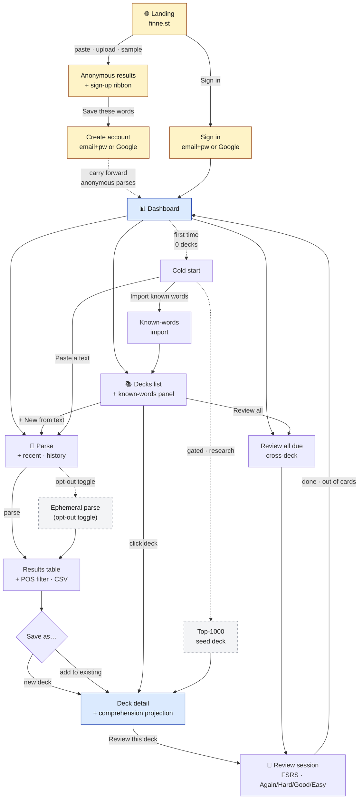
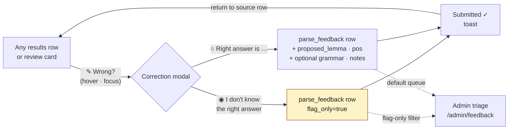

# FinEstDB — Consumer User Flows

_Created 2026-05-07 from a working session. Captures the consumer-alpha
user journey at the screen level, calls out where it diverges from
what's currently on `main`, and proposes designs for the open questions
(landing screen, correction UX, deck cold-start)._

This document is a **product spec**, not an implementation plan. For the
sequenced engineering work see [`TODO.md`](../TODO.md). For the deck /
FSRS / coverage data model see [`srs-deck-spec.md`](srs-deck-spec.md).
For the alpha product framing see [`FEATURES.md`](FEATURES.md).

Domain: **finne.st**.

## Map of the flow



In words:

1. **Anonymous path**: paste → results → "save these words" CTA → sign up. Anonymous parses are ephemeral; nothing server-side until sign-up.
2. **Returning path**: sign in → dashboard → parse / decks / review.
3. **Inner loop**: parse → results → save (new deck OR add to existing) → deck detail → review.
4. **Cold start**: a brand-new account with zero decks lands on the dashboard's empty state with three options — paste a text, import known words, or seed from the top-1000 baseline (gated on the research project).
5. **Cross-cutting correction**: from any results row or review card, the `✎ Wrong?` icon opens a modal with two paths (flag-only or propose-fix) — see §10 below.

Yellow nodes are anonymous-only. Dashed-border nodes are not yet built (cold-start top-1000, opt-out ephemeral parse). Blue hub nodes are the highest-traffic surfaces.

## Screen-by-screen

### 1. Landing + inline parse (anonymous)

The single most important change vs. what's on `main` today: **anonymous
users can parse without signing in**. The current alpha gates Parse
behind sign-in (`FEATURES.md` §"What We Store During Alpha"). This flow
is anonymous-first; sign-up is a hook *after* a successful parse.

```
┌────────────────────────────────────────────────────────────────┐
│  finne.st                                  [Theme] [Sign in]   │
├────────────────────────────────────────────────────────────────┤
│                                                                │
│      Learn Finnish & Estonian by reading what you love.        │
│      Paste any text. We'll show you every word, what it        │
│      means, and how often it appears.                          │
│                                                                │
│      ┌────────────────────────────────────────────────────┐    │
│      │ Language: [● Auto-detect  ○ FI  ○ ET]              │    │
│      │                                                    │    │
│      │ ┌─────────────────────────────────────────────┐    │    │
│      │ │ Paste a paragraph, an article, lyrics —     │    │    │
│      │ │ anything in Finnish or Estonian.            │    │    │
│      │ │                                             │    │    │
│      │ │                                             │    │    │
│      │ │                                             │    │    │
│      │ └─────────────────────────────────────────────┘    │    │
│      │                                                    │    │
│      │ [📎 Upload .txt / .md / .epub]                     │    │
│      │                                                    │    │
│      │ ▽ Detected: Finnish · 4,213 chars · 612 tokens     │    │
│      │   · 287 unique forms · 0 numbers                   │    │
│      │                                                    │    │
│      │                              [ Parse text ► ]      │    │
│      └────────────────────────────────────────────────────┘    │
│                                                                │
│      How it works  ·  Privacy  ·  About                        │
└────────────────────────────────────────────────────────────────┘
```

**Behavior**
- Paste / upload / drag-and-drop. Current accepted file types are `.txt`,
  `.md`, and `.epub`. Anki `.apkg` import is a separate known-words/import
  follow-up, not part of the current parse upload surface.
- The **stats strip under the textarea** (`Detected: ... · N chars · N
  tokens · ...`) is live, debounced. It also drives the language
  selector: high-confidence detection silently switches the radio (per
  current hybrid policy); selector–detection conflict on manually-typed
  text shows a non-blocking banner with a one-click "Switch to Finnish"
  affordance.
- 1,500,000 char limit (current cap; preserved).
- Anonymous parse runs **ephemerally**: nothing is stored server-side,
  no parse_session row, no IP retained beyond rate-limit window.
- Empty state below the box invites: _"Don't have text handy? [Try a
  Finnish news headline] [Try an Estonian children's poem]"_ — both are
  hardcoded sample texts.

**Open questions**
- Whether to show character count by code points or grapheme clusters
  (current code uses chars; matters for emoji-heavy paste).
- Whether to allow a third "Auto" mode in the language selector (today
  it's FI/ET only; auto-detect runs but the selector is binary).

### 2. Inline results (anonymous)

Today's `/results` page already exists (`web/index.html` lines
492–551). Reuse it for both anonymous and signed-in. The change is the
**sign-up hook ribbon at the top**:

```
┌────────────────────────────────────────────────────────────────┐
│  ← Back to parse                                               │
│  Coverage ███████░░░ 71% (estimated, no known-words list yet)  │
│                                                                │
│  ┌──────────────────────────────────────────────────────────┐  │
│  │ ✨ Want to remember these words?                         │  │
│  │ Sign up free to turn this list into a review deck —      │  │
│  │ we'll teach you the words you don't know in 5 min/day.   │  │
│  │                            [ Create account ] [ Later ]  │  │
│  └──────────────────────────────────────────────────────────┘  │
│                                                                │
│  287 unique words  ·  Custom parser  ·  342ms                  │
│                                                                │
│  [ All ] [ Nouns ] [ Verbs ] [ Adj ] [ Adv ] [ Other ]   [⇩CSV]│
│                                                                │
│  #  Form           Definition                  Count  Status   │
│  ── ──────────────  ──────────────────────────  ─────  ──────  │
│   1 olla            be, exist                     34   [ ]     │
│   2 hän             he, she                       22   [ ]     │
│   3 koira           dog                           18   [ ]     │
│   …                                                            │
└────────────────────────────────────────────────────────────────┘
```

**Behavior**
- Same table component as today.
- For anonymous users: "Status" column shows checkbox-only
  (multi-select); the per-row Known/Ignore actions only appear once
  signed in. Multi-selecting + `[ Export CSV ]` works without an
  account — this is a value drop that converts.
- The sign-up ribbon dismisses for the rest of the session if "Later"
  is clicked, but reappears on the next parse.
- Privacy footer near the table: _"This parse wasn't saved. Save it as a deck
  or submit feedback if you want FinEstDB to retain the source context."_

### 3. Sign-up / sign-in

Currently email+password only (`web/index.html` lines 170–194). The
flow needs a Google OAuth path; native iOS/Android sign-in (Apple,
Google for Android) is a later wrapper concern.

```
┌────────────────────────────────────────────────────────────────┐
│  [ Sign in │ Create account ]                                  │
│                                                                │
│  ┌──────────────────────────────────────────────────────────┐  │
│  │  [G]  Continue with Google                               │  │
│  └──────────────────────────────────────────────────────────┘  │
│                  ── or with email ──                           │
│                                                                │
│  First name:   [_______________]                               │
│  Email:        [_______________]                               │
│  Password:     [_______________]  (8+ chars)                   │
│                                                                │
│                                              [ Create ]        │
│                                                                │
│  By creating an account you agree to our Terms and Privacy.    │
│  We don't sell your data and don't train external models on it.│
└────────────────────────────────────────────────────────────────┘
```

**Account schema delta**
- Add `first_name` (required, string) — used to greet the user
  ("Welcome back, Sagar"). Last name is NOT required for alpha; ID is
  the existing `users.id`. Email stays unique per account.
- Add `auth_provider` (`password` | `google`) and `auth_provider_uid`
  (NULL for password, Google `sub` for Google).
- Anonymous parses from the same browser session can be **carried
  forward**: after sign-up, last-N anonymous parses (held in
  `sessionStorage`, scoped to the tab — *not* `localStorage`, which
  would survive browser restarts and contradict the
  anonymous-is-ephemeral promise) are POSTed to
  `/api/parse/import-anonymous`, re-parsed server-side, and saved as
  `parse_sessions` so the user doesn't lose what they just did. If we
  later want survival across restarts, it must be opt-in (a "remember
  these parses on this device" checkbox on the sign-up form) and
  documented in the privacy footer; never silent.

### 4. Dashboard (post-login default)

**Recommendation: dashboard, not parse, is the default landing for
signed-in users.** This matches what the app does today and gives
returning users their cold-pickup. New users (zero decks, zero known
words) see a slim variant that nudges them to either parse a text *or*
import their known words.

```
┌────────────────────────────────────────────────────────────────┐
│  Welcome back, Sagar.                                          │
│  Pick up where you left off, or read something new.            │
│                                                                │
│  ┌──────────┐  ┌──────────┐  ┌──────────┐                      │
│  │ Known: 0 │  │ Due: 0   │  │ New today│                      │
│  │   FI · ET│  │          │  │  /20     │                      │
│  └──────────┘  └──────────┘  └──────────┘                      │
│                                                                │
│  ┌────────────────────────────────────────────────────────┐    │
│  │  Read a new text   →   Parse Finnish or Estonian text  │    │
│  ├────────────────────────────────────────────────────────┤    │
│  │  Review due words  →   0 due — start by parsing a text │    │
│  ├────────────────────────────────────────────────────────┤    │
│  │  Your decks       →   0 decks                          │    │
│  └────────────────────────────────────────────────────────┘    │
│                                                                │
│  Recent parses                                                 │
│  ─────────────────────────────────────────────────────────     │
│  No parses yet. Try:                                           │
│   • [Paste a text]                                             │
│   • [Import known words I already know]                        │
│   • [Start with the top 1000 Finnish words]  ← cold-start path │
└────────────────────────────────────────────────────────────────┘
```

The "top 1000 words" cold-start CTA is gated on the research project
[`experiments/2026-05-07-top-1000-inflected-forms.md`](../experiments/2026-05-07-top-1000-inflected-forms.md)
shipping. Until then, the empty state shows only Paste and Import.

### 5. Parse (signed-in)

Same UX as the anonymous landing, **plus**:

- A **"Saved source context"** list below the form, sorted by `parsed_at`
  desc. It includes parses retained because the user saved a deck or submitted
  parser feedback. Each row: title (auto-derived from first line; editable),
  language, parse date, unique-form count, and a `[ ... ]` menu with `Open
  results`, `Save as deck`, `Add to existing deck`, and **`Delete from
  server`** (irreversible, with confirmation).
- A persistent **privacy chip** under the textarea: _"Not saved until
  deck/feedback. [Details]"_ — `Details` opens the parse-history/deletion page
  once that page exists.

### 6. Results (signed-in) → Save / Add-to-existing

Same table; the deltas are below the table:

```
  ────────────────────────────────────────────────────────────
  Save these 287 words as…

  ◉ A new deck
    Title: [The Hobbit, Chapter 1______________]
    □ Mark words I checked as already known (12 selected)

  ○ Add to an existing deck
    Deck: [▾ Finnish stories (842 words)         ]

                                       [ Cancel ] [ Save ► ]
```

**Behavior**
- "Add to existing deck" merges by `(lemma, pos)`; duplicates are
  silent no-ops. Token counts in `deck_lemma_stats` accumulate.
  Sentence/occurrence rows from the new parse are appended to the
  existing deck. This is **NEW** vs. current alpha (which only creates
  new decks).
- The "Mark checked as known" path bulk-inserts into
  `user_known_lemmas` for the resolved `(lemma, pos)`, then re-renders
  coverage in place.
- After save: redirect to the deck detail page, not back to dashboard,
  so the user sees what they just built.

### 7. Decks list

```
┌────────────────────────────────────────────────────────────────┐
│  Your decks                              [+ New from text]     │
│                                                                │
│  ┌──────────────────────────────────────────────────────────┐  │
│  │ Finnish stories                                FI  ⋯     │  │
│  │ 842 words  ·  68% known  ·  +14 new ready  ·  [Review]   │  │
│  ├──────────────────────────────────────────────────────────┤  │
│  │ Estonian children's poems                      ET  ⋯     │  │
│  │ 167 words  ·  42% known  ·  +8 new ready   ·  [Review]   │  │
│  └──────────────────────────────────────────────────────────┘  │
│                                                                │
│  ┌──────────────────────────────────────────────────────────┐  │
│  │ Review all due words across both languages   [Review →]  │  │
│  │ 23 cards due now                                         │  │
│  └──────────────────────────────────────────────────────────┘  │
│                                                                │
│  Known words                                                   │
│  Language: [▾ Finnish] · 1,204 known                           │
│  [+ Import] [+ Add manually] [Export CSV]                      │
└────────────────────────────────────────────────────────────────┘
```

The `⋯` per-deck menu has: `Rename`, `Open detail`, `Review`, `Export
CSV`, `Delete deck` (with "this won't unlearn the words you've already
mastered" confirmation copy — true because cards are global).

### 8. Deck detail

Mirrors the results page (same word table, same correction flow), with
a header band showing **comprehension prediction**:

```
  Finnish stories                                         FI  ⋯
  842 unique words  ·  68% token-weighted coverage

  ▰▰▰▰▰▰▰▱▱▱  68% covered now
  Learn the next 20 words → 81%
  Learn the next 50 words → 89%

  [Review this deck]  [Add 20 to today's queue]
```

The "Add N to today's queue" button bumps `new_per_day` for this deck
this session. The marginal-comprehension-gain numbers already have
their backend story in [`srs-deck-spec.md`](srs-deck-spec.md) and
their tasks in [`TODO.md`](../TODO.md) "Comprehension prediction per
deck".

### 9. Review

Largely as today (`web/index.html` lines 331–376). Two upgrades worth
calling out for the consumer alpha:

1. The deck filter at the top should be **"All decks · FI"** /
   **"All decks · ET"** by default for users with multi-language decks,
   not "All decks" mixed — switching language mid-stream is jarring.
2. The four FSRS buttons stay (`Again / Hard / Good / Easy`), but the
   alpha hand-rolled scheduler in `internal/store/db.go` should be
   replaced with `go-fsrs` per
   [`TODO.md`](../TODO.md) before this surface goes public.
3. Every card surface gets the **inline correction affordance** (see
   §10 below) — corrections shouldn't require leaving the review flow.

### 10. Correction flow — recommended design

The user asked: modal? button? inline? Existing implementation
(`web/index.html` lines 553–603) is a full modal triggered by an
explicit button per row. It works but is heavy. **Recommendation: keep
the modal, change the entry point and add a low-friction "just flag"
path.**



Yellow indicates the new "flag-only" path that captures users who
notice a wrong parse but can't articulate the fix — signal we're
losing today.

```
   Row in results table:
   ┌───────────────────────────────────────────────────────────┐
   │ 17 koira  · NOUN ·  dog                  18  [ Known ▾ ]  │
   │           ↳ ✎ Wrong?                                      │
   └───────────────────────────────────────────────────────────┘

   Hover/focus reveals the ✎ link. Click opens:

   ┌───────────────────────────────────────────────────────────┐
   │  Suggest a correction                              [×]    │
   │                                                           │
   │  Surface form:    koirat                                  │
   │  We parsed it as: koira · NOUN · partitive plural         │
   │                                                           │
   │  ◉ This is wrong (I don't know the right answer)          │
   │  ○ This is wrong, and the right answer is:                │
   │      Base form  [_______________]                         │
   │      POS        [▾ Noun]                                  │
   │      Grammar    [_______________] (optional)              │
   │      Notes      [_______________________]                 │
   │                                                           │
   │                                  [ Cancel ] [ Send ]      │
   └───────────────────────────────────────────────────────────┘
```

**Why this shape**
- The **two radios** are the key change. Today's modal forces the user
  to provide a corrected lemma+POS, which means most users won't bother
  if they don't know the answer (e.g. native speakers can flag "this
  feels wrong" without articulating the fix). Adding the
  "I-don't-know-the-right-answer" path captures signal we're currently
  losing — and admins can triage flag-only feedback as "review with
  Omorfi/EstNLTK and propose a fix."
- The **✎ icon as the entry point** (instead of a fully-rendered
  button column) keeps the row dense. It's discoverable on hover/focus
  without being visual noise. On touch devices the ✎ is always
  visible.
- The **modal pre-fills** the surface form, current lemma, and current
  grammar label. When the user selects "the right answer is …", the
  base-form input is pre-populated with the surface form (lowercase),
  not the current lemma, because if the parser was wrong the current
  lemma is the wrong starting point.
- The same modal is reused on **review cards** — there's a small
  "Wrong?" link below the meaning on the back of the card.

**Backend impact**
- `parse_feedback` already accepts `proposed_lemma` and `proposed_pos`.
  Make them nullable. Add a `flag_only` boolean (true = "I think this
  is wrong but I don't know the fix"). The admin triage queue
  (`/admin/feedback`) gets a filter for flag-only items, which usually
  need a maintainer to investigate before they can be accepted.

**Out of scope for alpha**
- Anonymous corrections (already deferred per `FEATURES.md`).
- Inline-edit-in-place ("just type the correct lemma into the row" —
  feels good but conflates display state with edit state and breaks
  the table sort).

## Privacy posture (visible UX)

The dictation emphasized privacy. This is what we should put in front
of the user, in priority order:

1. **Inspect parses are ephemeral until saved or submitted as feedback** —
   communicated below the textarea and in the post-parse ribbon: _"Your text
   was not saved. Save as a deck or submit feedback to retain source context."_
2. **Stored deck/feedback context has deletion and retention controls** — the
   History page lets users delete retained source context immediately, and raw
   retained source text is purged after 30 days while deck and feedback records
   remain.
4. **No external model training** — repeat in the privacy footer and
   privacy page (already in `FEATURES.md`).
5. **What we share with admins**: only the parses you submit
   corrections on, and only the surface form + your suggestion. Make
   this explicit in the correction modal (single sentence).

## Cold-start paths

The dictation noted the "no decks yet, no parses yet" gap. Three
ways out, in increasing engineering cost:

1. **Sample-text buttons** on the landing page (cheapest, ship now).
   Prepopulated FI and ET sample texts that result in parses with
   ~50–100 unique forms — enough to feel something but small enough to
   triage by hand.
2. **Known-word import**. Already in the codebase — just make it
   findable from the dashboard empty state, not buried in the Decks
   page.
3. **Top-1000 inflected forms seed deck**. Research project
   [`experiments/2026-05-07-top-1000-inflected-forms.md`](../experiments/2026-05-07-top-1000-inflected-forms.md).
   Once shipped, the dashboard empty state's third CTA goes live and
   becomes the dominant cold-start.

## Translation of example sentences

Open question from the dictation. Three options:

- **Cheapest**: don't translate. Show the sentence as-is. Honest but
  unhelpful for beginners.
- **Curated only**: ship translations only for sentences from corpora
  we already have aligned (e.g. licensed parallel text). Limits scope
  to a small fixed set of decks; doesn't help user-pasted content.
- **LLM at request time**: per `docs/ideas.md` "Making it AI native",
  add a `/api/translate-sentence` endpoint backed by Sonnet 4.6 with
  prompt caching on the per-language system prompt. Stream tokens.
  Cache results in a `sentence_translations` SQLite table only for
  persisted parse/deck content whose retention semantics allow derived text to
  survive the request. Skip the shared persistent cache for ephemeral Inspect
  parses; use only request-local/session-local state for those flows. The cache
  key should include source language, target language, prompt version,
  and `hash(sentence_text)`, and deleted source content must either
  delete or orphan-expire derived translations according to the same
  retention policy. Show a small `[Translate]` link below the sentence
  on the card back; on click, replaces with the streamed translation.

**Recommendation**: LLM at request time, with persistent caching only
where the source content is itself persisted and deletable. It scales to
any text the user pastes without corpus alignment work, while preserving
anonymous/opt-out semantics. The UX cost is the latency: pre-fetch on
card front so it's already there when the user flips to the back.

## Account model

Today's `users` schema (from `internal/store/db.go::initSchema`, plus
the `password_hash` column added by `ALTER`):

| Field | Status | Notes |
|---|---|---|
| `id` | exists | `INTEGER PRIMARY KEY AUTOINCREMENT` |
| `email` | exists | `TEXT UNIQUE` |
| `email_verified` | exists | `INTEGER DEFAULT 0`. For Google OAuth, verify the ID token and copy the OIDC `email_verified` claim; require `true` before treating the account as verified |
| `is_admin` | exists | `INTEGER DEFAULT 0` |
| `settings_json` | exists | `TEXT` JSON blob with `new_per_day`, `retention`, `theme`. The first-run register picker can store its choice here under a new key |
| `password_hash` | exists | `TEXT NOT NULL DEFAULT ''` (added by ALTER). For OAuth-only accounts the empty string already works as a placeholder; we'll relax/clarify the `NOT NULL` on the OAuth migration |

Migration deltas needed for the user flows in this doc:

| Field | Add | Notes |
|---|---|---|
| `first_name` | yes | for greeting copy on the dashboard. Required at signup |
| `last_name` | optional | not needed for alpha |
| `auth_provider` | yes | `password` \| `google`. Default `password` for existing rows |
| `auth_provider_uid` | yes | NULL for password, Google `sub` for Google. Unique on `(auth_provider, auth_provider_uid)` |
| `created_at` | yes | not currently on the table. Add `DATETIME DEFAULT CURRENT_TIMESTAMP` |
| `last_login_at` | yes | not currently on the table. Add nullable; updated on each session start |

`email_verified` already exists, so we should not add a separate
"verified" flag for Google sign-ins. The OAuth handler must verify the
ID token and copy the provider's `email_verified` claim; do not blindly
set the column to `1` for every Google response.

Profile page (out of scope for first version, but flagged): change
display name, change password (password accounts only), connected
accounts (link/unlink Google), delete account (cascades to parses,
decks, known-word lists).

## What's new vs. what's already on `main`

Items in the dictation that need engineering work because they're not
yet in the codebase:

- Anonymous parse path (current alpha is auth-gated). Reverses one
  consumer-alpha decision; requires rate limiting on
  `/api/parse` (already a `TODO.md` item).
- Live stats panel under the textarea (chars, tokens, unique forms,
  numbers). Today only char count exists.
- File-upload support for Anki `.apkg`. `.txt`, `.md`, and `.epub` are already
  implemented for the signed-in inspect/workbench forms.
- Google OAuth.
- "Add to existing deck" path on the results page.
- Parse-history UI with bulk delete for source context retained by saved decks
  and parser feedback.
- Correction flow: flag-only path; ✎-icon entry point.
- Cold-start "top 1000" CTA (gated on the research project).
- Sentence translation (LLM-backed).
- Comprehension prediction in deck detail (already in `TODO.md`).
- FSRS migration (already in `TODO.md`).

Items in the dictation that **already exist** and just need the user
to find them:

- POS-filtered, sortable results table.
- Coverage gauge.
- Save-as-deck.
- Per-row Known / Ignored toggling.
- Known-word import (currently only by surface forms; lemma resolution
  via the dictionary fallback chain).
- Deck rename.
- "Review all" cross-deck via `Review` page with no deck filter.
- Correction modal (heavy version — needs the lighter flow above).
- Light/dark theme.

## Out of scope (recorded so it doesn't leak in)

- Native iOS/Android apps. Single responsive web app for alpha.
- User-to-user deck sharing or a public catalog.
- Streaks, badges, social features.
- Pronunciation / TTS.
- Speech-input review (LLM judges fluency — flagged in
  `docs/ideas.md` Phase 5).
- A user-facing parser workbench (admin-only by design).
