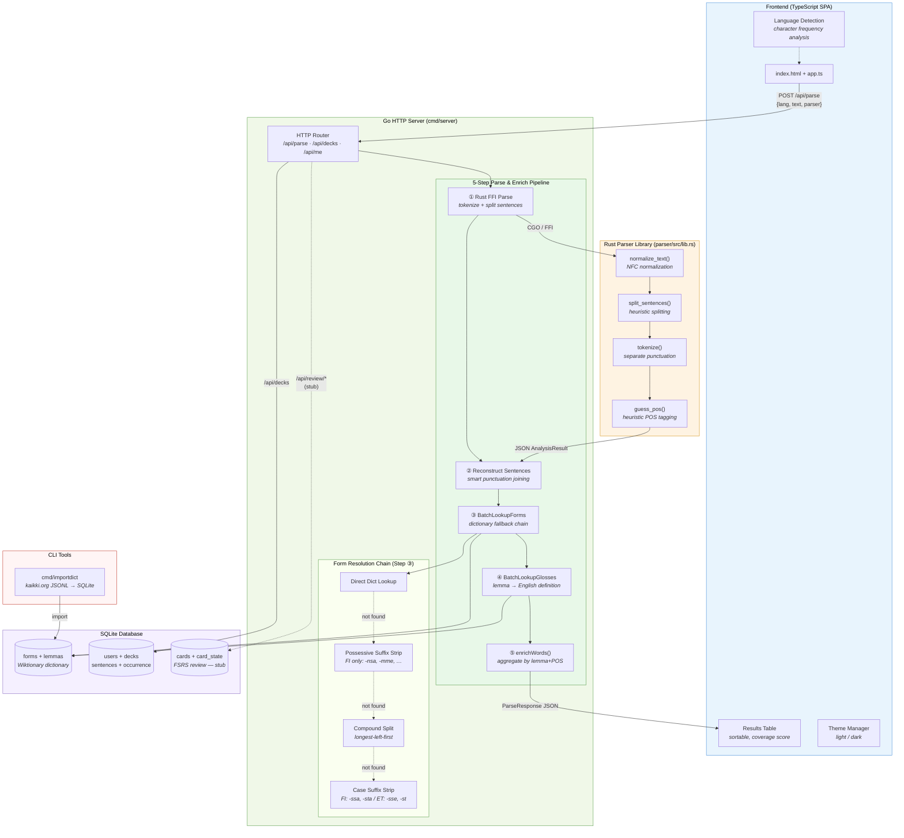
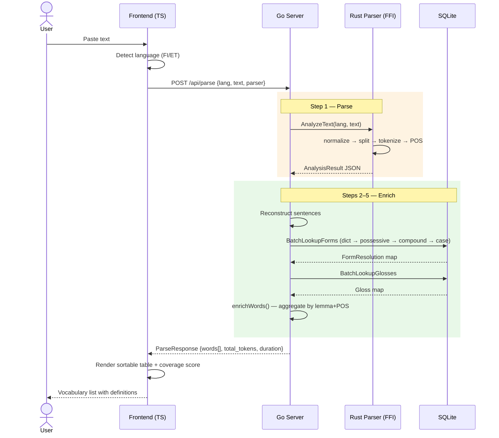
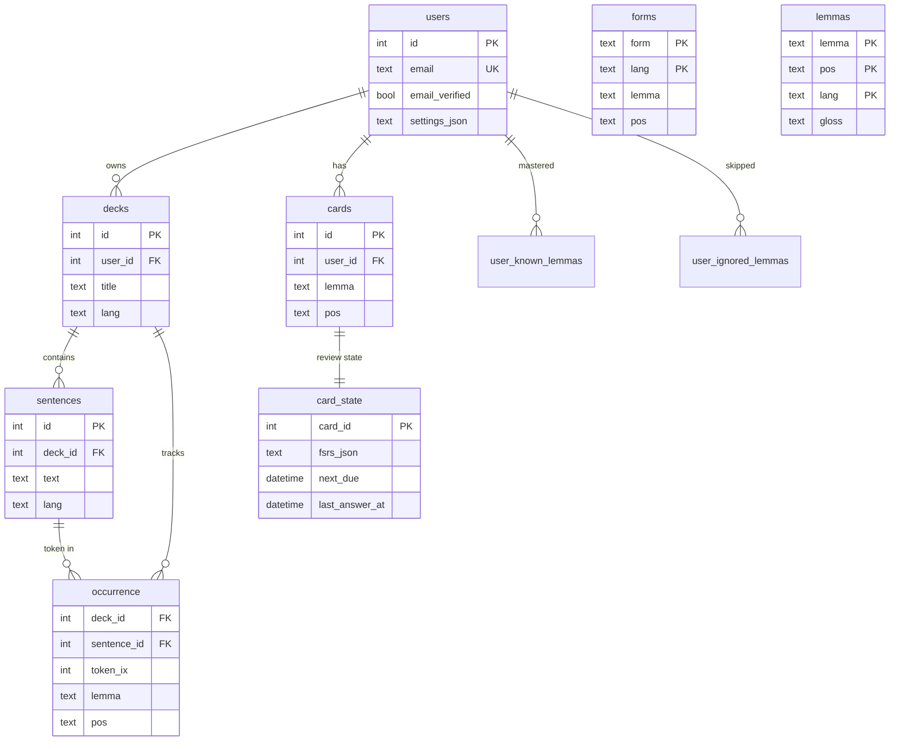
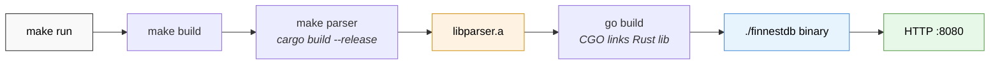

# FinEstDB Architecture

> Parser workbench for Finnish and Estonian text — dictionary-backed lemmatization and parser evaluation.

## System Overview



## Data Flow



## Tech Stack

| Layer | Technology | Language |
|-------|-----------|----------|
| Frontend | Vanilla SPA | TypeScript / HTML / CSS |
| Backend | HTTP server | Go 1.21+ |
| Parser | Tokenizer + POS heuristics | Rust (FFI via CGO) |
| Database | SQLite (go-sqlite3) | SQL |
| Dictionary | Wiktionary via kaikki.org | JSONL import |
| Build | Make + Cargo | Makefile |

## Directory Map

```
finnestdb/
├── cmd/
│   ├── server/main.go          # HTTP server entry point
│   └── importdict/main.go      # Dictionary import CLI
├── internal/
│   ├── api/
│   │   ├── handlers.go         # Route handlers + pipeline orchestration
│   │   └── enrichment.go       # Pure enrichWords() — CGO-free, testable
│   ├── store/
│   │   ├── db.go               # Schema, CRUD, user/deck management
│   │   └── dict.go             # Dictionary lookups + fallback chain
│   └── parserffi/
│       └── bindings.go         # CGO wrapper for Rust library
├── parser/
│   └── src/lib.rs              # Rust: tokenizer, sentence splitter, POS guesser
├── web/
│   ├── index.html              # SPA shell
│   ├── app.ts                  # Frontend logic (compiled → app.js)
│   └── styles.css              # Light + dark themes
└── Makefile                    # Build: Rust → Go → run
```

## Database Schema



## Build Pipeline


